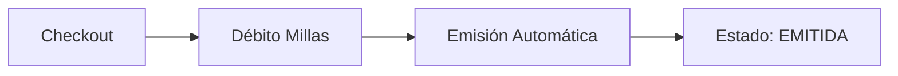
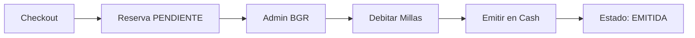

# 🎰 BGR Miles - Modelo PPM con Slider Millas + Plata

> Portal de redención con modelo mixto: Slider de pago entre Millas y Plata (efectivo)

---

## 📋 Información General

| Campo | Valor |
|-------|-------|
| **Portal** | https://bgrmiles-ec.preprodppm.com/ |
| **País** | Ecuador 🇪🇨 |
| **Modelo de Negocio** | B2B2C |
| **Plataforma** | PPM (Plataforma de Puntos y Millas) |
| **Célula** | Kepler |
| **Prefijo** | [BGR] |
| **Agente QA** | BGR_QA_Assistant |

---

## 💰 Modelo de Negocio - Slider Millas + Plata

### 🎚️ Tres Opciones de Pago

**1. Solo Millas (100% millas)**
```
Pago:     100% MILLAS
Emisión:  AUTOMÁTICA ⚡
Tarjeta:  NO requerida
Proceso:  Sin intervención manual
```

**2. Millas + Plata (Pago Mixto) - Slider**
```
Pago:     MILLAS (slider %) + PLATA (tarjeta)
Emisión:  SEMIAUTOMÁTICA (manual) 🔧
Tarjeta:  REQUERIDA
Proceso:  Debitar millas → Pagar cash → Emitir
```

**3. Solo Plata (0% millas)**
```
Estado:   ❌ NO PERMITIDO
Razón:    Slider tiene mínimo obligatorio
```

### 📊 Mínimos del Slider por Producto

| Producto | Mínimo Slider |
|----------|---------------|
| 🛫 **Vuelos** | 2,875 millas fijas |
| 🏨 **Hoteles** | 20% del total |
| 🚗 **Autos** | 20% del total |
| 🎢 **Actividades** | 20% del total |
| 🎠 **Disney** | 20% del total |

---

## 🔄 Proceso de Emisión

### ✅ Emisión Automática (Solo Millas)



**Características:**
- ✅ Sin intervención manual
- ✅ Estado EMITIDA inmediato
- ✅ Usuario recibe confirmación al instante

### 🔧 Emisión Semiautomática (Millas + Plata)



**Pasos del proceso manual:**
1. Reserva queda en estado **PENDIENTE**
2. Ingresar al **admin BGR**
3. Buscar reserva por código
4. **Debitar millas** manualmente
5. **Emitir en cash** (pagar al proveedor)
6. Estado final: **EMITIDA**

---

## 📦 Productos y Proveedores

### 🛫 Vuelos
- **AGGREGATOR - NETACTICA** (sin dispersión de fondos)
- **AGGREGATOR - SABRE** (sin dispersión de fondos)
- **SABRE EDIFACT** (sin dispersión de fondos)
- Slider mínimo: 2,875 millas

### 🏨 Hoteles
- **HotelBeds**
- Slider mínimo: 20%

### 🚗 Autos
- **Proveedor:** Sabre
- **Empresas:** Hertz, Dollar, Thrifty
- Slider mínimo: 20%

### 🎢 Actividades
- **HotelBeds**
- Slider mínimo: 20%

### 🎠 Disney
- **OffLine**
- Slider mínimo: 20%

---

## ✅ Validaciones Críticas

### Slider de Pago
- ✅ Visible en pantalla de disponibilidad
- ✅ Respeta mínimo por producto
- ✅ NO permite bajar del mínimo
- ✅ Cálculo correcto: Total = Millas + Plata
- ✅ Movimiento del slider funcional

### Checkout
- ✅ Campos obligatorios completos
- ✅ Tarjeta requerida solo en Millas + Plata
- ✅ Términos y condiciones aceptados
- ✅ Débito de millas según slider
- ✅ Botón de compra habilitado correctamente

### Confirmación
- ✅ Código de reserva visible
- ✅ Resumen de pagos (millas y/o plata)
- ✅ Valores consistentes con checkout

### Admin BGR
- ✅ Reserva localizable por código
- ✅ Solo Millas: Estado EMITIDA automáticamente
- ✅ Millas + Plata: Estado PENDIENTE
- ✅ Proceso manual completable

---

## 🔄 Proceso de Cancelación

### Cancelar Reserva Millas + Plata (SIN emisión)

**Estado inicial:** PENDIENTE

**Pasos:**
1. Ingresar al admin BGR
2. Buscar reserva por código
3. Click en "Cancelar"
4. Confirmar cancelación
5. Sistema devuelve millas automáticamente
6. Estado final: CANCELADO

**Validaciones:**
- ✅ No se debitan millas (no se ejecutó débito)
- ✅ No se emite en cash (no se realizó emisión)
- ✅ Millas devueltas al saldo original
- ✅ Usuario puede reutilizar las millas

---

## 📊 Matriz de Estados

| Modelo de Pago | Estado Inicial | Proceso | Estado Final |
|----------------|----------------|---------|--------------|
| **Solo Millas** | EMITIDA | Automático | EMITIDA |
| **Millas + Plata** | PENDIENTE | Manual (débito + emisión) | EMITIDA |
| **Cancelada (Mixta)** | PENDIENTE | Cancelar desde admin | CANCELADO |

---

## 🎯 Diferencias Clave vs Pichincha Miles (PM)

| Aspecto | BGR Miles | Pichincha Miles |
|---------|-----------|-----------------|
| **Modelo** | Slider Millas + Plata | 100% Millas fijo |
| **Opciones** | 100% Millas o Mixto | Solo 100% Millas |
| **Fee Vuelos** | ❌ No | ✅ Sí |
| **Emisión 100%** | Automática | Automática |
| **Emisión Mixta** | Manual | N/A |
| **Tarjeta** | Opcional | Obligatoria (fee) |
| **Proceso** | Más complejo | Más simple |
| **Estados** | Más variados | Menos estados |
| **Pago efectivo** | ✅ Sí (mixto) | ❌ No |

---

## 📚 Documentación de Referencia

**Reglas de Negocio:**
- [BGR_COMMON_RULES.md](../../../shared/Kepler/BGR_COMMON_RULES.md) - Reglas comunes BGR

**Flujos por Producto:**
- [BGR_VUELOS.md](../../../products/B2B2C/PPM/BGR/BGR_VUELOS.md) - Flujo E2E Vuelos
- [BGR_HOTELES.md](../../../products/B2B2C/PPM/BGR/BGR_HOTELES.md) - Flujo E2E Hoteles
- [BGR_AUTOS.md](../../../products/B2B2C/PPM/BGR/BGR_AUTOS.md) - Flujo E2E Autos
- [BGR_ACTIVIDADES.md](../../../products/B2B2C/PPM/BGR/BGR_ACTIVIDADES.md) - Flujo E2E Actividades
- [BGR_DISNEY.md](../../../products/B2B2C/PPM/BGR/BGR_DISNEY.md) - Flujo E2E Disney

**Agente QA:**
- [BGR_QA_Assistant](../../../agents/BGR_QA_Assistant.agent.md) - Agente especializado BGR

---

## 🚀 Testing

**Complejidad:** ALTA

**Razones:**
- Dos modelos de pago diferentes
- Proceso manual en modo mixto
- Validación de slider
- Múltiples estados de reserva
- Cancelaciones con devolución de millas

**Casos Críticos:**
1. Validar slider en todos los productos
2. Probar emisión automática (100% millas)
3. Probar proceso manual (millas + plata)
4. Validar cancelaciones con devolución
5. Verificar cálculos de millas y plata
6. Probar todos los proveedores

---

## 📞 Contacto

**Agente QA:** BGR_QA_Assistant  
**Ubicación:** `.github/agents/BGR_QA_Assistant.agent.md`

**Para:**
- Crear casos de prueba BGR
- Análisis de HU BGR
- Consultas técnicas BGR

---

**Última actualización:** 2026-01-08  
**Versión:** 1.0  
**Estado:** ✅ Activo

