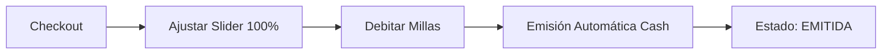
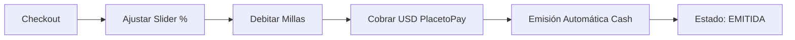

# � ClubMiles Ecuador (CME) - Modelo PPM con Copago

> Portal de lealtad con modelo flexible: Millas o Millas + Plata (Copago)

---

## 📋 Información General

| Campo | Valor |
|-------|-------|
| **Nombre Completo** | ClubMiles Ecuador (CME) |
| **Portal Test** | https://clubmiles-ec.developppm.com/ |
| **Portal Demo** | https://clubmiles-ec.preprodppm.com/ |
| **País** | Ecuador 🇪🇨 |
| **Modelo de Negocio** | B2B2C (Modelo de Lealtad) |
| **Plataforma** | PPM (Plataforma de Puntos y Millas) |
| **Célula** | Kepler |
| **Prefijo** | [CME] |
| **Cliente Final** | Diners Club |
| **Agente QA** | CME_QA_Assistant |

---

## 🏢 Cadena de Valor

```
UltraGroup (desarrollador)
    ↓
PPM (distribuidor)
    ↓
Diners Club (cliente)
    ↓
Socios (usuarios finales)
```

**Descripción:**
1. **UltraGroup** desarrolla CME
2. **PPM** compra y distribuye CME
3. **Diners Club** ofrece CME como programa de fidelización
4. **Socios** (clientes Diners) usan CME para canjear millas

---

## 💰 Modelo de Negocio - Millas o Copago

### 🎚️ Dos Métodos de Pago

**1. Solo Millas (100% Millas)**
```
Pago:     100% MILLAS
Emisión:  AUTOMÁTICA ⚡
Tarjeta:  NO requerida (excepto fee vuelos)
Proceso:  Sin intervención manual
```

**2. Millas + Plata (Copago)**
```
Pago:     MILLAS (slider %) + PLATA (USD en TC)
Emisión:  AUTOMÁTICA ⚡
Tarjeta:  REQUERIDA (para parte USD)
Pasarela: PlacetoPay (bash, sin interfaz visual)
Proceso:  Automático
```

**3. Solo Plata (0% millas)**
```
Estado:   ❌ NO PERMITIDO
Razón:    Mínimo 20% en millas obligatorio
```

### 📊 Slider Ajustable en Checkout

**Ubicación:** Solo visible en pantalla **Checkout**

**Configuración:**
- **Mínimo:** 20% del valor en millas
- **Máximo:** 100% del valor o total de millas disponibles
- **Ajuste:** Manual por el socio

**Lógica de Comportamiento:**

| Escenario | Condición | Acción |
|-----------|-----------|--------|
| **1** | Millas ≥ 100% del producto | ✅ Slider disponible (20% - 100%) |
| **2** | Millas ≥ 20% pero < 100% | ✅ Slider disponible (20% - millas disponibles) |
| **3** | Millas < 20% del producto | ❌ Pop-up: "Debe comprar más Millas" |

---

## 🔄 Proceso de Emisión

### ✅ Emisión Automática (Ambos Modelos)

**Solo Millas:**


**Copago (Millas + Plata):**


**Características:**
- ✅ Emisión tipo "Cash" siempre
- ✅ Sin intervención manual
- ✅ Estado EMITIDA inmediato
- ✅ PlacetoPay conexión bash (sin interfaz visible)

---

## 📦 Productos y Proveedores

### 🛫 Vuelos
- **Proveedores:** AGGREGATOR NETACTICA, SABRE, EDIFACT
- **Pago:** Millas o Millas+Plata (slider en checkout)
- **Fee:** ✅ Sí (tarjeta obligatoria, dentro de checkout, NO lightbox)
- **Pasarela:** PlacetoPay (bash, sin interfaz)

### 🏨 Hoteles
- **Proveedor:** HotelBeds
- **Pago:** Millas o Millas+Plata (slider en checkout)
- **Fee:** ❌ No
- **Pasarela:** PlacetoPay (bash, solo si hay copago)

### 🚗 Autos
- **Proveedor:** Sabre (Hertz, Dollar, Thrifty)
- **Pago:** Millas o Millas+Plata (slider en checkout)
- **Fee:** ❌ No
- **Pasarela:** PlacetoPay (bash, solo si hay copago)

### 🎢 Actividades
- **Proveedor:** HotelBeds
- **Pago:** Millas o Millas+Plata (slider en checkout)
- **Fee:** ❌ No
- **Pasarela:** PlacetoPay (bash, solo si hay copago)

### 🎠 Disney
- **Proveedor:** Pendiente definir
- **Pago:** Millas o Millas+Plata (slider en checkout)
- **Fee:** ❌ No
- **Pasarela:** PlacetoPay (bash, solo si hay copago)

---

## 🔐 Autenticación y Navegación

### Proceso de Login

**Portal de Autenticación:** Cliente PPM (fuera de control UltraGroup)

**Pasos:**
1. Ingresar número de identificación
2. Ingresar contraseña
3. Ingresar código **OTP** enviado al correo

### Navegación Sin Login

**✅ Permitido:**
- Buscar en Home
- Ver resultados en Disponibilidad
- Consultar precios

**❌ Bloqueado:**
- Continuar después de Disponibilidad
- Acceder a Checkout
- Realizar reservas

---

## ✅ Validaciones Críticas

### Slider de Millas
- ✅ Visible solo en Checkout
- ✅ Mínimo 20% respetado
- ✅ No puede bajar del mínimo
- ✅ Cálculo correcto: Total = Millas + USD
- ✅ Ajuste manual funcional

### Saldo Insuficiente
- ✅ Millas < 20%: Pop-up bloqueante
- ✅ Millas ≥ 20%: Slider disponible
- ✅ Mensaje claro: "Debe comprar más Millas"

### Copago con PlacetoPay
- ✅ Conexión bash (sin mostrar interfaz)
- ✅ Cobro correcto en USD
- ✅ Débito de millas correcto
- ✅ Emisión automática tras pago

### Fee de Vuelos
- ✅ Tarjeta obligatoria
- ✅ Formulario dentro de checkout (NO lightbox)
- ✅ Conexión bash PlacetoPay
- ✅ Fee cobrado correctamente

### Modal OTP
- ✅ Solo si tarjeta requiere OTP
- ✅ Código enviado al correo
- ✅ Validación correcta

---

## 📊 Matriz de Productos

| Producto | Proveedor | Slider | Fee | Pasarela | Emisión |
|----------|-----------|--------|-----|----------|---------|
| **Vuelos** | AGGREGATOR, SABRE, EDIFACT | ✅ 20%-100% | ✅ TC | PlacetoPay | Automática |
| **Hoteles** | HotelBeds | ✅ 20%-100% | ❌ No | PlacetoPay | Automática |
| **Autos** | Sabre | ✅ 20%-100% | ❌ No | PlacetoPay | Automática |
| **Actividades** | HotelBeds | ✅ 20%-100% | ❌ No | PlacetoPay | Automática |
| **Disney** | TBD | ✅ 20%-100% | ❌ No | PlacetoPay | Automática |

---

## 🎯 Diferencias Clave vs PM y BGR

| Aspecto | CME | PM | BGR |
|---------|-----|----|----|
| **Slider** | ✅ 20%-100% | ❌ No | ✅ Variable |
| **Copago** | ✅ Sí | ❌ No | ✅ Sí |
| **Fee Vuelos** | ✅ En checkout | ✅ Lightbox | ❌ No |
| **Pasarela** | PlacetoPay bash | Lightbox | Checkout |
| **Emisión** | Automática Cash | Automática | Auto/Manual |
| **Login** | Portal PPM + OTP | Portal PM | Portal BGR |
| **Navegación sin login** | ✅ Hasta Disponibilidad | ❌ No | ❌ No |

---

## 📚 Documentación de Referencia

**Reglas de Negocio:**
- [CME_COMMON_RULES.md](../../../shared/Kepler/CME_COMMON_RULES.md) - Reglas comunes CME

**Flujos por Producto:**
- [CME_VUELOS.md](../../../products/B2B2C/PPM/CME/CME_VUELOS.md) - Flujo E2E Vuelos
- [CME_HOTELES.md](../../../products/B2B2C/PPM/CME/CME_HOTELES.md) - Flujo E2E Hoteles
- [CME_AUTOS.md](../../../products/B2B2C/PPM/CME/CME_AUTOS.md) - Flujo E2E Autos
- [CME_ACTIVIDADES.md](../../../products/B2B2C/PPM/CME/CME_ACTIVIDADES.md) - Flujo E2E Actividades
- [CME_DISNEY.md](../../../products/B2B2C/PPM/CME/CME_DISNEY.md) - Flujo E2E Disney

**Agente QA:**
- [CME_QA_Assistant](../../../agents/CME_QA_Assistant.agent.md) - Agente especializado CME

---

## 🚀 Testing

**Complejidad:** MEDIA-ALTA

**Razones:**
- Slider ajustable con mínimo 20%
- Copago con PlacetoPay
- Validación de saldo con pop-up bloqueante
- Login externo con OTP
- Navegación sin login permitida
- Fee de vuelos dentro de checkout

**Casos Críticos:**
1. Validar slider mínimo 20%
2. Probar copago con PlacetoPay
3. Validar pop-up millas insuficientes
4. Probar login con OTP
5. Verificar navegación sin login
6. Validar fee de vuelos en checkout
7. Probar emisión automática ambos modelos

---

## 📞 Contacto

**Agente QA:** CME_QA_Assistant  
**Ubicación:** `.github/agents/CME_QA_Assistant.agent.md`

**Para:**
- Crear casos de prueba CME
- Análisis de HU CME
- Consultas técnicas CME

---

**Última actualización:** 2026-01-08  
**Versión:** 1.0  
**Estado:** ✅ Activo

