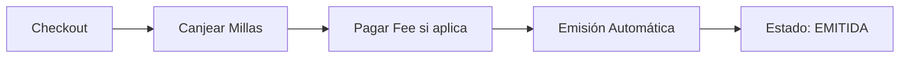

# � Pichincha Miles - Modelo PPM 100% Millas

> Portal de redención con modelo fijo: 100% Millas + Fee en vuelos

---

## 📋 Información General

| Campo | Valor |
|-------|-------|
| **Portal** | https://pichinchamiles-ec.preprodppm.com/ |
| **País** | Ecuador 🇪🇨 |
| **Modelo de Negocio** | B2B2C |
| **Plataforma** | PPM (Plataforma de Puntos y Millas) |
| **Célula** | Kepler |
| **Prefijo** | [PM] |
| **Agente QA** | PM_QA_Assistant |

---

## 💰 Modelo de Negocio - 100% Millas

### 💳 Ecuación de Pago

**VUELOS:**
```
Producto:   100% MILLAS (valor total del vuelo)
Fee:        TARJETA DE CRÉDITO (fee de procesamiento)
Emisión:    AUTOMÁTICA ⚡
```

**OTROS PRODUCTOS** (Hoteles, Autos, Actividades, Disney):
```
Producto:   100% MILLAS (único pago)
Fee:        ❌ NO
Tarjeta:    ❌ NO requerida
Emisión:    AUTOMÁTICA ⚡
```

### 🔄 Características del Modelo

- ✅ **Modelo fijo:** Usuario paga 100% en millas siempre
- ❌ **Sin slider:** No hay opción de pago mixto
- ❌ **Sin pago efectivo:** Solo millas
- ✅ **Emisión automática:** Sin intervención manual
- ✅ **Fee solo vuelos:** Tarjeta obligatoria para fee de vuelos
- ✅ **Proceso simple:** Canjear → Confirmar → Listo

---

## 🔄 Proceso de Emisión

### ✅ Emisión Automática (Todos los Productos)



**Características:**
- ✅ Sin intervención manual
- ✅ Estado EMITIDA inmediato
- ✅ Usuario recibe confirmación al instante
- ✅ Un solo modelo para todos los productos

---

## 📦 Productos y Proveedores

### 🛫 Vuelos (Angular)
- **AGGREGATOR - NETACTICA** (sin dispersión de fondos)
- **AGGREGATOR - SABRE** (sin dispersión de fondos)
- **SABRE EDIFACT** (con dispersión de fondos)
- **Fee:** Obligatorio con tarjeta (lightbox)

### 🏨 Hoteles (Angular)
- **HotelBeds**
- **Fee:** No aplica

### 🚗 Autos (Meteor)
- **Proveedor:** Sabre
- **Empresas:** Hertz, Dollar, Thrifty
- **Fee:** No aplica

### 🎢 Actividades (Angular)
- **HotelBeds**
- **Fee:** No aplica

### 🎡 Disney (React)
- **DerbySoft**
- **Fee:** No aplica

---

## ✅ Validaciones Críticas

### Saldo de Millas
- ✅ Validar que usuario tenga millas suficientes
- ✅ Bloquear checkout si millas insuficientes
- ✅ Mostrar saldo actual en todo el flujo

### Fee de Vuelos
- ✅ Fee visible en disponibilidad
- ✅ Tarjeta obligatoria en checkout
- ✅ Lightbox de pago funcional
- ✅ Fee cobrado correctamente

### Checkout
- ✅ Campos obligatorios completos
- ✅ Links de términos funcionales
- ✅ Botón canjear habilitado solo con validaciones OK
- ✅ Cálculo correcto de millas

### Confirmación
- ✅ Código de reserva visible
- ✅ Resumen de millas canjeadas
- ✅ Valores consistentes con checkout
- ✅ Estado EMITIDA en admin

### Admin
- ✅ Reserva localizable por código
- ✅ Estado EMITIDA automáticamente
- ✅ Todos los datos correctos
- ✅ Proveedor correcto

---

## 📊 Matriz de Productos

| Producto | Proveedor Principal | Pago | Fee | Emisión | Tecnología |
|----------|---------------------|------|-----|---------|------------|
| **Vuelos** | AGGREGATOR NETACTICA, SABRE, EDIFACT | 100% Millas | ✅ TC | Automática | Angular |
| **Hoteles** | HotelBeds | 100% Millas | ❌ No | Automática | Angular |
| **Autos** | Sabre (Hertz, Dollar, Thrifty) | 100% Millas | ❌ No | Automática | Meteor |
| **Actividades** | HotelBeds | 100% Millas | ❌ No | Automática | Angular |
| **Disney** | DerbySoft | 100% Millas | ❌ No | Automática | React |

---

## 🎯 Diferencias Clave vs BGR Miles

| Aspecto | Pichincha Miles (PM) | BGR Miles |
|---------|----------------------|-----------|
| **Modelo** | 100% Millas fijo | Slider Millas + Plata |
| **Opciones** | Solo 100% Millas | 100% Millas o Mixto |
| **Fee Vuelos** | ✅ Sí | ❌ No |
| **Emisión** | Automática siempre | Auto (100%) / Manual (mixto) |
| **Tarjeta** | Obligatoria (fee vuelos) | Opcional (solo mixto) |
| **Proceso** | Más simple | Más complejo |
| **Estados** | Menos estados | Más variados |
| **Pago efectivo** | ❌ No | ✅ Sí (mixto) |
| **Slider** | ❌ No existe | ✅ Sí |

---

## 📚 Documentación de Referencia

**Reglas de Negocio:**
- [PM_COMMON_RULES.md](../../../shared/Kepler/PM_COMMON_RULES.md) - Reglas comunes PM

**Flujos por Producto:**
- [PM_VUELOS.md](../../../products/B2B2C/PPM/PM/PM_VUELOS.md) - Flujo E2E Vuelos
- [PM_HOTELES.md](../../../products/B2B2C/PPM/PM/PM_HOTELES.md) - Flujo E2E Hoteles
- [PM_AUTOS.md](../../../products/B2B2C/PPM/PM/PM_AUTOS.md) - Flujo E2E Autos
- [PM_ACTIVIDADES.md](../../../products/B2B2C/PPM/PM/PM_ACTIVIDADES.md) - Flujo E2E Actividades
- [PM_DISNEY.md](../../../products/B2B2C/PPM/PM/PM_DISNEY.md) - Flujo E2E Disney

**Agente QA:**
- [PM_QA_Assistant](../../../agents/PM_QA_Assistant.agent.md) - Agente especializado PM

---

## 🚀 Testing

**Complejidad:** MEDIA

**Razones:**
- ✅ Un solo modelo de pago
- ✅ Emisión siempre automática
- ✅ Menos estados de reserva
- ⚠️ Fee de vuelos agrega validación
- ✅ Proceso lineal y predecible

**Casos Críticos:**
1. Validar saldo suficiente/insuficiente
2. Probar fee de vuelos (lightbox)
3. Verificar emisión automática
4. Validar tarjeta válida/inválida (vuelos)
5. Probar todos los proveedores
6. Verificar cálculo de millas

---

## 💡 Ventajas del Modelo PM

**Para QA:**
- ✅ Más fácil de probar (un solo flujo)
- ✅ Menos variaciones de pago
- ✅ Sin proceso manual de emisión
- ✅ Validaciones más directas

**Para el Usuario:**
- ✅ Proceso simple y rápido
- ✅ Confirmación inmediata
- ✅ Sin pagos adicionales (excepto fee vuelos)
- ✅ Experiencia predecible

---

## 📞 Contacto

**Agente QA:** PM_QA_Assistant  
**Ubicación:** `.github/agents/PM_QA_Assistant.agent.md`

**Para:**
- Crear casos de prueba PM
- Análisis de HU PM
- Consultas técnicas PM

---

**Última actualización:** 2026-01-08  
**Versión:** 1.0  
**Estado:** ✅ Activo

