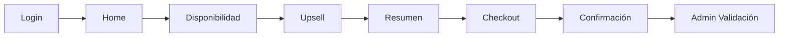
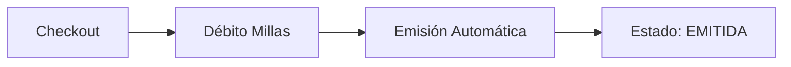
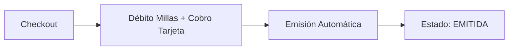

# 🎰 MRS Mastercard - Modelo Solo Millas o Millas + Plata

> Portal de redención Mastercard con modelo mixto: Slider de pago entre Millas y Plata (efectivo)

---

## 📋 Información General

| Campo | Valor |
|-------|-------|
| **Portal** | https://austec.smartlinks.dev/es-ec (Austro - Ecuador) |
| | https://ficsahonduras.smartlinks.dev/es-hn (Ficohsa - Honduras) |
| | https://ficsaguatemala.smartlinks.dev/es-gt (Ficohsa - Guatemala) |
| | https://ficsapanama.smartlinks.dev/es-pa (Ficohsa - Panamá) |
| | https://ficsanicaragua.smartlinks.dev/es-ni (Ficohsa - Nicaragua) |
| | https://cpn-mrs.smartlinks.dev/es-cr (Coopenae - Costa Rica) |
| **Clientes** | Austro, Ficohsa (multi-país), Coopenae |
| **País** | Ecuador, Honduras, Guatemala, Panamá, Nicaragua, Costa Rica |
| **Modelo de Negocio** | B2B2C |
| **Plataforma** | MRS (Mastercard Rewards System) |
| **Célula** | Skynet |
| **Prefijo** | [MRS] |
| **Agente QA** | MRS_QA_Assistant |

---

## 💰 Modelo de Negocio - Slider Millas + Plata

### 🎚️ Dos Opciones de Pago

**1. Solo Millas (100% millas)**
```
Pago:     100% MILLAS
Emisión:  AUTOMÁTICA ⚡
Tarjeta:  NO requerida
Proceso:  Sin intervención manual
```

**2. Millas + Plata (Pago Mixto) - Slider**
```
Pago:     MILLAS (slider %) + PLATA (tarjeta)
Emisión:  AUTOMÁTICA ⚡
Tarjeta:  REQUERIDA
Proceso:  Sin intervención manual
```

### 📊 Mínimos del Slider por Producto

⚠️ **IMPORTANTE:** Los mínimos del slider son **configurables desde el Admin MRS** por cada cliente.

| Producto | Mínimo Slider (Configurable) | Ejemplo Común |
|----------|------------------------------|---------------|
| 🛫 **Vuelos** | Configurable desde Admin | 2875 millas |
| 🏨 **Hoteles** | Configurable desde Admin | 20% del total |
| 🚗 **Autos** | Configurable desde Admin | 20% del total |
| 🎢 **Actividades** | Configurable desde Admin | 20% del total |
| 🎠 **Disney** | Configurable desde Admin | 20% del total |

**Nota:** Verificar la configuración actual en el Admin MRS del cliente antes de validar el slider en casos de prueba.

---

## 🔐 Autenticación SSO

MRS utiliza **Single Sign-On (SSO)** mediante SAML para autenticación de usuarios.

### Proceso de Login:

1. **Generar token SSO** via `security/api/saml/acs`
2. **Vigencia del token:** 24 horas (TTL 12h)
3. **Usar token** en URL de login: `https://[portal]/es-ec/auth?token={TOKEN}`

### Usuarios para Testing:

| Tipo | Código | Estado | Uso |
|------|--------|--------|-----|
| ✅ **Recomendado** | 001 | Good Standing | Usuarios activos |
| ⚠️ Opcional | 002 | New | Nuevos usuarios |
| ❌ No usar | 000, 003, 004, 005 | Otros estados | Inactivos/Bloqueados |

### Validación de Login Exitoso:

✅ Sin redirecciones externas  
✅ Sesión activa en DevTools  
✅ Endpoint users responde 200  

**📋 Documentación completa:** Ver [MRS_COMMON_RULES.md - Autenticación SSO](../../../shared/Reglas%20Marketplace/MRS_COMMON_RULES.md#-autenticación-sso-single-sign-on)

---

## 🗺️ Flujo E2E Completo

### Pantallas del Proceso (Todas las Transacciones)



**Descripción del Flujo:**

1. **Login**
   - Usuario ingresa credenciales o usa **SSO (Single Sign-On)**
   - **Autenticación SSO:** Token generado via `security/api/saml/acs` (vigencia 24h)
   - Tipos de usuario: **001 – Good Standing** (recomendado para testing)
   - Autenticación en MRS (Austro/Ficohsa/Coopenae)
   - Acceso a portal del cliente correspondiente
   - 📋 [Ver detalle autenticación SSO](../../../shared/Reglas%20Marketplace/MRS_COMMON_RULES.md#-autenticación-sso-single-sign-on)

2. **Home**
   - Pantalla inicial de búsqueda
   - Usuario selecciona producto (Vuelos, Hoteles, Autos, Actividades, Disney)
   - Ingresa criterios de búsqueda

3. **Disponibilidad**
   - Resultados de búsqueda
   - **Slider de Millas + Plata visible**
   - Usuario ajusta % de millas vs plata
   - Selección de opción

4. **Upsell**
   - Ofertas adicionales
   - Upgrades disponibles
   - Seguros, servicios extra

5. **Resumen**
   - Detalle completo de la selección
   - Resumen de costos
   - **Confirmación de slider:** Millas + Plata
   - Revisión antes de checkout

6. **Checkout**
   - Datos del pasajero/usuario
   - **Confirmación final de slider**
   - Datos de tarjeta (si es Millas + Plata)
   - Términos y condiciones

7. **Confirmación**
   - Código de reserva
   - Resumen de pago:
     - **Solo Millas:** Millas debitadas
     - **Millas + Plata:** Millas debitadas + Monto USD
   - Instrucciones siguientes pasos

8. **Admin - Validación de Reservas**
   - Ingreso al administrador MRS del cliente correspondiente
   - Búsqueda por código de reserva
   - Validaciones:
     - **Solo Millas (100%):** Estado EMITIDA automáticamente ✅
     - **Millas + Plata:** Estado EMITIDA automáticamente ✅

---

## �🔄 Proceso de Emisión

### ✅ Emisión Automática (Solo Millas)



**Características:**
- ✅ Sin intervención manual
- ✅ Estado EMITIDA inmediato
- ✅ Usuario recibe confirmación al instante

### 🔧 Emisión Automática (Millas + Plata)



**Características:**
- ✅ Sin intervención manual
- ✅ Estado EMITIDA inmediato
- ✅ Usuario recibe confirmación al instante
- ✅ Débito de millas y cobro en tarjeta procesados automáticamente

---

## 📦 Productos y Proveedores

### 🛫 Vuelos
- **AGGREGATOR - NETACTICA** (sin dispersión de fondos)
- **AGGREGATOR - SABRE** (sin dispersión de fondos)
- **SABRE EDIFACT** (sin dispersión de fondos)
- Slider mínimo: 2875 millas

### 🏨 Hoteles
- **Hotel Sabre**
- Slider mínimo: 20%

### 🚗 Autos
- **Proveedor:** Sabre
- **Empresas:** Hertz, Dollar, Thrifty
- Slider mínimo: 20%

### 🎢 Actividades
- **HotelBeds**
- Slider mínimo: 20%

### 🎠 Disney
- **OffLine**
- Slider mínimo: 20%

---

## ✅ Validaciones Críticas

### Slider de Pago
- ✅ Visible en pantalla de disponibilidad
- ✅ Respeta mínimo por producto
- ✅ NO permite bajar del mínimo
- ✅ Cálculo correcto: Total = Millas + Plata
- ✅ Movimiento del slider funcional

### Checkout
- ✅ Campos obligatorios completos
- ✅ Tarjeta requerida solo en Millas + Plata
- ✅ Términos y condiciones aceptados
- ✅ Débito de millas según slider
- ✅ Botón de compra habilitado correctamente

### Confirmación
- ✅ Código de reserva visible
- ✅ Resumen de pagos (millas y/o plata)
- ✅ Valores consistentes con checkout

### Admin MRS
- ✅ Reserva localizable por código
- ✅ Solo Millas: Estado EMITIDA automáticamente
- ✅ Millas + Plata: Estado EMITIDA automáticamente
- ✅ Validar débito de millas y cobro procesados correctamente
- ✅ Acceso al admin del cliente correspondiente (Austro/Ficohsa/Coopenae)

---

## 🔄 Proceso de Cancelación

### Cancelar Reserva EMITIDA (Solo Millas o Millas + Plata)

**Estado inicial:** EMITIDA

**Pasos:**
1. Ingresar al admin MRS del cliente correspondiente
2. Buscar reserva por código
3. Click en "Cancelar" (según políticas del producto)
4. Confirmar cancelación
5. Sistema devuelve millas automáticamente (según políticas)
6. Sistema reversa cobro en tarjeta si fue Millas + Plata (según políticas)
7. Estado final: CANCELADO

**Validaciones:**
- ✅ Reserva estaba EMITIDA (emisión automática)
- ✅ Millas devueltas según políticas de cancelación
- ✅ Reverso de cobro en tarjeta si aplica
- ✅ Usuario puede reutilizar las millas (si se devolvieron)

---

## 📊 Matriz de Estados

| Modelo de Pago | Estado Inicial | Proceso | Estado Final |
|----------------|----------------|---------|--------------|
| **Solo Millas** | EMITIDA | Automático | EMITIDA |
| **Millas + Plata** | EMITIDA | Automático | EMITIDA |
| **Cancelada** | EMITIDA | Cancelar desde admin | CANCELADO |

---

## 🎯 Diferencias Clave vs Pichincha Miles (PM)

| Aspecto | MRS (Mastercard) | Pichincha Miles |
|---------|------------------|-----------------|
| **Modelo** | Slider Millas + Plata | 100% Millas fijo |
| **Opciones** | 100% Millas o Mixto | Solo 100% Millas |
| **Fee Vuelos** | ❌ No | ✅ Sí |
| **Emisión 100%** | Automática | Automática |
| **Emisión Mixta** | Automática | N/A |
| **Tarjeta** | Opcional (solo mixto) | Obligatoria (fee) |
| **Proceso** | Totalmente automático | Más simple |
| **Estados** | Más variados | Menos estados |
| **Pago efectivo** | ✅ Sí (mixto) | ❌ No |
| **Clientes** | Austro, Ficohsa, Coopenae | Pichincha |

---

## 📚 Documentación de Referencia

**Reglas de Negocio:**
- [MRS_COMMON_RULES.md](../../../shared/Reglas%20Marketplace/MRS_COMMON_RULES.md) - Reglas comunes MRS
- [Autenticación SSO](../../../shared/Reglas%20Marketplace/MRS_COMMON_RULES.md#-autenticación-sso-single-sign-on) - Proceso de login SSO

**Flujos por Producto:**
- [MRS_VUELOS.md](MRS_VUELOS.md) - Flujo E2E Vuelos
- [MRS_HOTELES.md](MRS_HOTELES.md) - Flujo E2E Hoteles
- [MRS_AUTOS.md](MRS_AUTOS.md) - Flujo E2E Autos
- [MRS_ACTIVIDADES.md](MRS_ACTIVIDADES.md) - Flujo E2E Actividades
- [MRS_DISNEY.md](MRS_DISNEY.md) - Flujo E2E Disney

**Autenticación y Seguridad:**
- [Wiki: Login SSO Mastercard MRS](https://dev.azure.com/ultragrouplaorg/ultragroupla/_wiki/wikis/Ultra%20Group%20Wiki/1342/Login-SSO-Mastercard-MRS-Generación-Token) - Guía completa de generación de token SSO
- Colección Postman: MasterCard - MRS.postman_collection.json

**Agente QA:**
- [MRS_QA_Assistant](../../../agents/MRS_QA_Assistant.agent.md) - Agente especializado MRS

---

## 🚀 Testing

**Complejidad:** ALTA

**Razones:**
- Dos modelos de pago diferentes
- Emisión automática en ambos modelos
- Validación de slider
- Políticas de cancelación
- Cancelaciones con devolución de millas

**Casos Críticos:**
1. Validar slider en todos los productos (mínimos específicos)
2. Probar emisión automática (100% millas)
3. Probar emisión automática (millas + plata)
4. Validar cancelaciones con políticas de devolución
5. Verificar cálculos de millas y plata
6. Probar todos los proveedores (NETACTICA, SABRE, Hotel Sabre, etc.)
7. Validar acceso a cada admin por cliente (Austro, Ficohsa, Coopenae)
8. Validar estado EMITIDA inmediato en ambos modelos de pago

---

## 📞 Contacto

**Agente QA:** MRS_QA_Assistant  
**Ubicación:** `.github/agents/MRS_QA_Assistant.agent.md`

**Para:**
- Crear casos de prueba MRS
- Análisis de HU MRS
- Consultas técnicas MRS
- Trabajo con portales Austro, Ficohsa y Coopenae

---

**Última actualización:** 2026-01-08  
**Versión:** 1.0  
**Estado:** ✅ Activo

