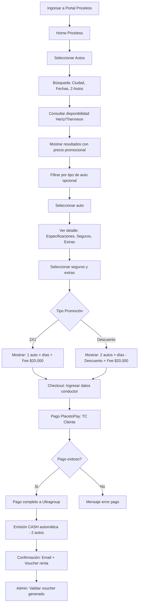

# 🚗 PRICELESS 2X1 - AUTOS

**Marketplace:** Mastercard Priceless 2X1  
**Producto:** Autos (Renta de vehículos)  
**Framework:** React  
**Proveedores:** Hertz, Thermeon (solo México)  
**URL Test:** https://test-skynet-pmc.smartlinks.dev/es-co  
**URL Demo:** https://demo-skynet-pmc.smartlinks.dev/es-co  
**URL Prod:** https://vuelaconoccidente.com/es-co

---

## 📋 Información General

**Características:**
- ✅ Promociones: 2X1 o Descuento aplicadas al precio final
- ✅ Markup: $10,000 COP por auto (2 autos = $20,000 COP)
- ✅ Pago: Directo al Marketplace (Ultragroup)
- ✅ Emisión: SIEMPRE en CASH (automática)
- ✅ Proveedores: Hertz (Colombia), Thermeon (México)
- ❌ NO aplican los 7 escenarios de Vuelos
- ❌ NO hay dispersión de fondos
- ❌ NO se usa TC Corporativa
- ❌ NO hay fee oculto

**Tipos de Renta:**
- Recogida y entrega en la misma ciudad
- Recogida y entrega en ciudades diferentes (One-way)
- Renta por días

**Restricciones:**
- 🔴 Obligatorio 2 autos (para aplicar promoción)
- 🔴 Mínimo 1 día de renta
- 🔴 Conductor debe tener edad mínima (según políticas del proveedor)
- 🔴 Licencia de conducir válida obligatoria
- 🔴 Thermeon solo disponible para México (no Colombia)

---

## 🏗️ Arquitectura

### Proveedores

| Proveedor | País | Dispersión | Modelo de Pago | Emisión |
|-----------|------|------------|----------------|----------|
| **Hertz** | Colombia | ❌ NO | 1 transacción TC Cliente → Ultragroup | CASH automática |
| **Thermeon** | México | ❌ NO | 1 transacción TC Cliente → Ultragroup | CASH automática |

**Nota:** Thermeon es un agregador de múltiples rentadoras en México, por lo que la dispersión y fee oculto dependen de la rentadora específica.

### Framework: React

**Componentes principales:**
- `CarSearch.jsx` - Buscador de autos
- `CarResults.jsx` - Listado de autos disponibles
- `CarDetail.jsx` - Detalle del auto (especificaciones, seguros, extras)
- `CarCheckout.jsx` - Checkout y pago
- `CarConfirmation.jsx` - Confirmación de reserva

---

## 🔄 Flujo E2E - Autos

---

## 🎯 Pantallas del Flujo

### 1. **Home**
- Selector de producto: Vuelos, Hoteles, Autos
- Banner promocional Priceless 2X1
- **⚠️ Acceso directo:** NO requiere login/registro

### 2. **Búsqueda Autos**
- Ciudad de recogida
- Fecha y hora de recogida
- Ciudad de entrega (puede ser la misma)
- Fecha y hora de entrega
- Cantidad de autos: **FIJO 2 autos** (obligatorio para promoción)
- Edad del conductor (para validaciones de políticas)
- Botón: Buscar

**Validaciones:**
- ✅ Fecha recogida ≥ Hoy
- ✅ Fecha entrega > Fecha recogida
- ✅ Mínimo 1 día de renta
- ✅ Cantidad autos = 2 (obligatorio)
- ✅ Edad conductor ≥ Mínimo permitido (generalmente 21-25 años)
- ✅ Ciudad de recogida/entrega válida

### 3. **Resultados**
- Lista de autos disponibles
- Por cada auto:
  - Foto del auto
  - Marca y modelo
  - Categoría (Económico, Compacto, SUV, etc.)
  - Capacidad (pasajeros y maletas)
  - Transmisión (Manual/Automática)
  - Aire acondicionado
  - **Precio ORIGINAL (tachado)**
  - **Precio CON PROMOCIÓN (destacado)**
  - Tipo promoción: "2X1" o "Descuento $X"
  - Botón: Ver detalle

**Filtros disponibles:**
- Tipo de auto (Económico, Compacto, Mediano, SUV, Lujo)
- Transmisión (Manual, Automática)
- Capacidad de pasajeros
- Proveedor (Hertz, Thermeon)

**Cálculo mostrado:**
- **2X1:** Precio = (Tarifa diaria × Días) × 1 + Markup $20,000
- **Descuento:** Precio = [(Tarifa diaria × Días) × 2 - Descuento] + Markup $20,000

### 4. **Detalle del Auto**
- Galería de fotos del auto
- Especificaciones completas:
  - Marca, Modelo, Año
  - Categoría
  - Pasajeros
  - Maletas grandes / Maletas pequeñas
  - Transmisión
  - Aire acondicionado
  - Combustible
  - Kilometraje (ilimitado/limitado)
- **Seguros disponibles:**
  - Seguro básico (incluido)
  - LDW (Loss Damage Waiver) - Opcional
  - PAI (Personal Accident Insurance) - Opcional
  - Seguro de terceros - Opcional
- **Extras disponibles:**
  - GPS
  - Silla para niños
  - Conductor adicional
  - Tanque lleno (prepago)
- Políticas de la rentadora:
  - Edad mínima
  - Documentos requeridos
  - Depósito/Garantía
  - Política de combustible
  - Cancelación
- Desglose de precio:
  - Tarifa diaria × Días
  - Seguros seleccionados
  - Extras seleccionados
  - Impuestos
  - Descuento (si aplica)
  - Markup: $20,000 COP (2 autos)
  - **Total a pagar**
- Botón: Continuar

### 5. **Datos del Conductor**
- Auto 1 - Conductor principal:
  - Nombre completo
  - Email
  - Teléfono
  - Documento de identidad
  - Número de licencia de conducir
  - Fecha de vencimiento licencia
  - Fecha de nacimiento
- Auto 2 - Conductor:
  - Nombre completo
  - Documento de identidad
  - Número de licencia de conducir
  - Fecha de vencimiento licencia
  - Fecha de nacimiento
- Observaciones especiales (opcional)
- Botón: Continuar a pago

**Validaciones:**
- ✅ Todos los campos obligatorios completos
- ✅ Email válido
- ✅ Teléfono válido
- ✅ Licencia vigente (no vencida)
- ✅ Edad mínima cumplida
- ✅ Documentos válidos

### 6. **Checkout - Resumen y Pago**
- Resumen del auto seleccionado
- Ubicación y fechas de recogida/entrega
- Días totales de renta
- Seguros y extras seleccionados
- Datos del conductor
- Desglose final de precio
- **Tipo de promoción aplicada**
- Políticas de la rentadora
- Términos y condiciones
- Botón: Pagar con PlacetoPay

### 7. **PlacetoPay**
- Redirige a pasarela PlacetoPay
- Usuario ingresa datos de tarjeta TC Cliente
- Sistema procesa pago: 1 transacción → Ultragroup (total)
- Emisión CASH automática iniciada

### 8. **Confirmación**
- Mensaje: "¡Reserva de auto exitosa!"
- Código de reserva
- Detalle del auto
- Fechas y ubicación de recogida/entrega
- Datos del conductor
- Seguros y extras contratados
- Precio final pagado
- Voucher de renta (PDF descargable)
- Instrucciones para recogida del auto
- Email de confirmación enviado
- Botón: Ver mi reserva

### 9. **Admin - Validación**
- Acceso admin Priceless
- Buscar reserva por código
- Validar:
  - Estado: EMITIDA
  - Emisión: CASH (automática)
  - Método de pago: 1 transacción TC Cliente
  - Voucher generado correctamente
  - Seguros y extras registrados

---

## 🔥 Validaciones Críticas - Modelo Simplificado

### Flujo Único de Pago/Emisión

**Modelo aplicable a TODOS los proveedores (Hertz y Thermeon):**
- ✅ 1 transacción TC Cliente vía PlacetoPay
- ✅ Pago completo a Ultragroup (Marketplace)
- ✅ Emisión CASH automática para 2 autos
- ❌ NO hay dispersión de fondos
- ❌ NO se usa TC Corporativa

**Validaciones:**
- ✅ Promoción 2X1 o Descuento aplicada correctamente al precio final
- ✅ Markup = $20,000 COP (2 autos)
- ✅ Pago procesado: TC Cliente → Total completo a Ultragroup
- ✅ Voucher CASH generado automáticamente para 2 autos
- ✅ Seguros y extras incluídos en el voucher
- ✅ 1 sola transacción visible en admin
- ✅ Confirmación enviada al cliente con voucher descargable
- ❌ Sin fee oculto (NO aplica en autos)

---

## 🧪 Casos de Prueba Críticos

### CP001: Auto 2X1 - Hertz - Dispersión Activa - Sin Fee Oculto
**Escenario:** 1  
**Prioridad:** 1 (Crítico)

**Precondiciones:**
- Proveedor Hertz con dispersión ACTIVA
- Promoción: 2X1
- Fee Oculto: NO

**Pasos:**
1. Login en portal Priceless
2. Seleccionar "Autos"
3. Ingresar búsqueda: Bogotá, 2 autos, 5 días
4. Seleccionar auto económico con promoción 2X1
5. Verificar precio mostrado = (Tarifa × 5) × 1 + $20,000
6. Seleccionar seguros y extras (opcional)
7. Ingresar datos de conductores (2 autos)
8. Continuar a pago
9. Pagar con TC Cliente
10. Verificar en admin: 2 transacciones (TC Cliente + TC Corporativa)
11. Verificar voucher generado para 2 autos

**Resultado Esperado:**
- ✅ Promoción 2X1 aplicada (cliente paga 1 auto)
- ✅ Fee $20,000 visible
- ✅ Pago procesado con 2 transacciones
- ✅ Voucher correcto para 2 autos

### CP002: Auto Descuento - Thermeon México - Dispersión Inactiva
**Escenario:** 6  
**Prioridad:** 1 (Crítico)

**Precondiciones:**
- Proveedor Thermeon (México) con dispersión INACTIVA
- Promoción: Descuento
- Fee Oculto: NO

**Pasos:**
1. Login en portal Priceless
2. Seleccionar "Autos"
3. Ingresar búsqueda: Ciudad de México, 2 autos, 3 días
4. Seleccionar auto con descuento (Thermeon)
5. Verificar descuento visible en resultados
6. Verificar precio = [(Tarifa × 3) × 2 - Descuento] + $20,000
7. Seleccionar seguros LDW y GPS
8. Ingresar datos de conductores
9. Continuar a pago
10. Pagar con TC Cliente
11. Verificar en admin: 1 transacción TC Cliente (total)
12. Verificar voucher CASH generado

**Resultado Esperado:**
- ✅ Descuento aplicado correctamente
- ✅ Cliente paga 2 autos con descuento
- ✅ Fee $20,000 visible
- ✅ Voucher CASH para 2 autos
- ✅ Seguros y extras registrados

### CP003: Validación 2 Autos Obligatorios
**Prioridad:** 2

**Pasos:**
1. Login en portal Priceless
2. Seleccionar "Autos"
3. Intentar modificar cantidad de autos a 1 o 3+

**Resultado Esperado:**
- 🔒 Selector de autos bloqueado en 2
- ⚠️ Mensaje: "Promoción válida para 2 autos únicamente"

### CP005: Validación Edad Mínima Conductor
**Prioridad:** 2

**Pasos:**
1. Ingresar a portal Priceless (sin login requerido)
2. Realizar búsqueda indicando edad < 21 años
3. Intentar seleccionar auto

**Resultado Esperado:**
- ⚠️ Mensaje: "Edad mínima requerida: 21 años (o según políticas del proveedor)"
- 🔒 No permitir continuar con la reserva

### CP006: Validación Licencia Vencida
**Prioridad:** 2

**Pasos:**
1. Llegar a pantalla de datos de conductor
2. Ingresar fecha de vencimiento de licencia < Hoy
3. Intentar continuar

**Resultado Esperado:**
- ❌ Error de validación
- ⚠️ Mensaje: "La licencia de conducir debe estar vigente"
- 🔒 No permitir continuar

### CP007: One-Way (Recogida y entrega en ciudades diferentes)
**Prioridad:** 2

**Pasos:**
1. Login en portal Priceless
2. Seleccionar "Autos"
3. Ingresar búsqueda: Recogida Bogotá, Entrega Medellín, 2 autos, 4 días
4. Verificar si hay cargo adicional por one-way
5. Seleccionar auto
6. Verificar que el cargo one-way esté incluido en el precio
7. Completar reserva

**Resultado Esperado:**
- ✅ Cargo one-way mostrado claramente (si aplica)
- ✅ Promoción aplicada correctamente
- ✅ Voucher indica recogida y entrega en ciudades diferentes

### CP007: Cancelación Auto - Modelo Simplificado
**Prioridad:** 2

**Precondiciones:**
- Reserva EMITIDA (CASH)
- Dentro del período de cancelación permitido

**Pasos:**
1. Ingresar al admin Priceless
2. Buscar reserva por código
3. Verificar políticas de cancelación del proveedor
4. Click en "Cancelar"
5. Confirmar cancelación
6. Verificar estado = CANCELADO en el sistema
7. **Equipo de operaciones ejecuta reverso manualmente:**
   - Reverso TC Cliente (única transacción - proceso manual)
8. Validar reembolso procesado según políticas

**Resultado Esperado:**
- ✅ Cancelación procesada según políticas
- ✅ Estado actualizado a CANCELADO
- ⚠️ **Reverso NO automático:** Ejecutado manualmente por operaciones
- ✅ Reverso de 1 transacción TC Cliente (proceso manual)
- ✅ Markup reembolsado (según políticas)
- ✅ Cliente notificado de cancelación

### CP009: Seguros y Extras Múltiples
**Prioridad:** 3

**Pasos:**
1. Seleccionar auto
2. Agregar múltiples seguros: LDW + PAI
3. Agregar múltiples extras: GPS + Silla niño + Conductor adicional
4. Verificar que el precio se actualice correctamente
5. Continuar a checkout
6. Verificar desglose de precio detallado
7. Completar reserva
8. Verificar voucher incluya todos los seguros/extras

**Resultado Esperado:**
- ✅ Precio actualizado dinámicamente
- ✅ Desglose claro de cada seguro/extra
- ✅ Voucher muestra todos los servicios contratados

### CP010: Voucher PDF Descargable
**Prioridad:** 2

**Pasos:**
1. Completar reserva de auto exitosamente
2. En pantalla de confirmación, click en "Descargar Voucher"
3. Verificar descarga de PDF
4. Abrir PDF y validar información:
   - Datos del auto
   - Fechas y ubicación de recogida/entrega
   - Datos del conductor
   - Seguros y extras
   - Código de reserva
   - Precio pagado
   - Instrucciones para recogida
   - Logo Priceless

**Resultado Esperado:**
- ✅ PDF se descarga correctamente
- ✅ Información completa y correcta
- ✅ Formato profesional

---

## 📊 Matriz de Cobertura

**Modelo Único:**
- ✅ Pago directo a Ultragroup
- ✅ Emisión CASH automática
- ❌ Sin escenarios complejos

**Casos de Prueba:**
- Promoción 2X1: CP001
- Promoción Descuento: CP002
- 2 Autos obligatorios: CP003
- Edad mínima: CP004
- Licencia vencida: CP005
- One-way: CP006
- Cancelaciones: CP007
- Seguros/Extras: CP008
- Voucher PDF: CP009

---

## 🚨 Casos Borde y Excepciones

1. **Auto no disponible para fechas seleccionadas:**
   - No mostrar en resultados
   - Sugerir fechas alternativas

2. **Promoción NO disponible para proveedor:**
   - Mostrar precio regular (sin promoción)
   - Indicar que promoción no aplica

3. **Cambio de precio entre búsqueda y checkout:**
   - Mostrar nuevo precio claramente
   - Usuario debe aceptar antes de pagar

4. **Error en PlacetoPay:**
   - Pago rechazado → No se emite reserva
   - Usuario puede reintentar

5. **Dispersión falla:**
   - Log de error en admin
   - Alertar a equipo de soporte
   - Intentar emisión manual

6. **Fee Oculto no procesado:**
   - Bloquear emisión
   - Alertar a equipo técnico
   - Resolver manualmente

7. **Conductor menor de edad mínima:**
   - Bloquear búsqueda o selección
   - Mostrar mensaje claro sobre edad mínima

8. **Licencia vencida o inválida:**
   - No permitir completar reserva
   - Solicitar licencia vigente

9. **One-way no disponible:**
   - Mostrar mensaje: "Entrega en ciudad diferente no disponible"
   - Sugerir entrega en misma ciudad

10. **Cancelación fuera de política:**
    - Calcular penalidad según políticas del proveedor
    - Mostrar monto a retener
    - Confirmar con usuario antes de procesar
    - **Reverso parcial:** Procesado manualmente por operaciones

11. **Depósito/Garantía requerida:**
    - Informar claramente el monto del depósito
    - Indicar que se hace al recoger el auto (no en línea)
    - Especificar método de pago aceptado para depósito

12. **Thermeon solo México:**
    - Si búsqueda es en Colombia → No mostrar Thermeon
    - Si búsqueda es en México → Mostrar ambos proveedores

---

## 📚 Referencias

**Documentación:**
- [PRICELESS_COMMON_RULES.md](../../../shared/Reglas%20Marketplace/PRICELESS_COMMON_RULES.md)
- [README.MD](README.MD)
- [Wiki: Mastercard - Priceless 2X1](https://dev.azure.com/ultragrouplaorg/ultragroupla/_wiki/wikis/Ultra%20Group%20Wiki/1141/Mastercard-Priceless-2X1)
- [Excel: Calcular 2x1 o descuento.xlsx](https://smartlinksdev-my.sharepoint.com/:x:/r/personal/crubiog_ultragroupla_com/_layouts/15/Doc.aspx?sourcedoc=%7B64CBE898-E0F2-402B-88AB-1093813C7C49%7D)

**Agente:**
- [PRICELESS_QA_Assistant](../../../agents/PRICELESS_QA_Assistant.agent.md)

---

**Última actualización:** 2026-02-03  
**Versión:** 1.0  
**Estado:** ✅ Activo
