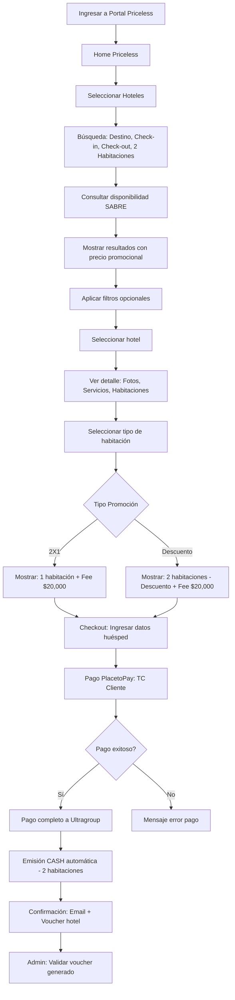

# 🏨 PRICELESS 2X1 - HOTELES

**Marketplace:** Mastercard Priceless 2X1  
**Producto:** Hoteles  
**Framework:** Angular  
**Proveedor:** SABRE  
**URL Test:** https://test-skynet-pmc.smartlinks.dev/es-co  
**URL Demo:** https://demo-skynet-pmc.smartlinks.dev/es-co  
**URL Prod:** https://vuelaconoccidente.com/es-co

---

## 📋 Información General

**Características:**
- ✅ Promociones: 2X1 o Descuento aplicadas al precio final
- ✅ Markup: $10,000 COP por habitación (2 habitaciones = $20,000 COP)
- ✅ Pago: Directo al Marketplace (Ultragroup)
- ✅ Emisión: SIEMPRE en CASH (automática)
- ✅ Proveedor Único: SABRE
- ❌ NO aplican los 7 escenarios de Vuelos
- ❌ NO hay dispersión de fondos
- ❌ NO se usa TC Corporativa
- ❌ NO hay fee oculto

**Tipos de Búsqueda:**
- Por ciudad/destino
- Por nombre de hotel
- Búsqueda con filtros (estrellas, servicios, precio)

**Restricciones:**
- 🔴 Obligatorio 2 habitaciones (para aplicar promoción)
- 🔴 Promoción aplicable solo para hoteles participantes
- 🔴 Mínimo 1 noche de estadía

---

## 🏗️ Arquitectura

### Proveedor: SABRE

**Tipo:** Directo  
**Dispersión:** ❌ NO (pago directo a Ultragroup)  
**Fee Oculto:** ❌ NO aplica  
**Modelo de Pago:** 1 transacción TC Cliente → Ultragroup  
**Emisión:** CASH automática (voucher para 2 habitaciones)

### Framework: Angular

**Componentes principales:**
- `hotel-search.component` - Buscador de hoteles
- `hotel-results.component` - Listado de hoteles disponibles
- `hotel-detail.component` - Detalle del hotel (fotos, servicios, habitaciones)
- `hotel-checkout.component` - Checkout y pago
- `hotel-confirmation.component` - Confirmación de reserva

---

## 🔄 Flujo E2E - Hoteles

---

## 🎯 Pantallas del Flujo

### 1. **Home**
- Selector de producto: Vuelos, Hoteles, Autos
- Banner promocional Priceless 2X1
- **⚠️ Acceso directo:** NO requiere login/registro

### 2. **Búsqueda Hoteles**
- Destino (Ciudad/País)
- Fecha Check-in
- Fecha Check-out
- Habitaciones: **FIJO 2 habitaciones** (obligatorio para promoción)
- Huéspedes por habitación: Adultos, Niños
- Botón: Buscar

**Validaciones:**
- ✅ Fecha Check-in ≥ Hoy
- ✅ Fecha Check-out > Fecha Check-in
- ✅ Mínimo 1 noche
- ✅ Habitaciones = 2 (obligatorio)
- ✅ Destino válido

### 3. **Resultados**
- Lista de hoteles disponibles
- Por cada hotel:
  - Nombre del hotel
  - Foto principal
  - Estrellas (rating)
  - Dirección/zona
  - Servicios destacados (WiFi, Piscina, etc.)
  - **Precio ORIGINAL (tachado)**
  - **Precio CON PROMOCIÓN (destacado)**
  - Tipo promoción: "2X1" o "Descuento $X"
  - Botón: Ver detalle

**Filtros disponibles:**
- Rango de precio
- Estrellas (1-5)
- Servicios (WiFi, Piscina, Desayuno, Parking, Gym)
- Zona/Barrio
- Tipo de hotel (Business, Resort, Boutique)

**Cálculo mostrado:**
- **2X1:** Precio = (Precio habitación × Noches) × 1 + Markup $20,000
- **Descuento:** Precio = [(Precio habitación × Noches) × 2 - Descuento] + Markup $20,000

### 4. **Detalle del Hotel**
- Galería de fotos (slider)
- Descripción completa
- Servicios del hotel (listado completo)
- Mapa de ubicación
- Políticas del hotel (check-in, check-out, cancelación)
- Tipos de habitación disponibles:
  - Nombre habitación (Ej: Estándar, Superior, Suite)
  - Servicios de la habitación
  - Capacidad (personas)
  - **Precio ORIGINAL (tachado)**
  - **Precio CON PROMOCIÓN**
  - Botón: Seleccionar
- Desglose de precio:
  - Precio habitación × Noches
  - Impuestos
  - Descuento (si aplica)
  - Markup: $20,000 COP (2 habitaciones)
  - **Total a pagar**

### 5. **Datos del Huésped**
- Habitación 1:
  - Nombre completo
  - Email
  - Teléfono
  - Documento
- Habitación 2:
  - Nombre completo
  - Documento
- Solicitudes especiales (opcional)
- Botón: Continuar a pago

**Validaciones:**
- ✅ Todos los campos obligatorios completos
- ✅ Email válido
- ✅ Teléfono válido
- ✅ Documentos válidos

### 6. **Checkout - Resumen y Pago**
- Resumen del hotel
- Fechas de estadía (Check-in / Check-out)
- Noches totales
- Datos del huésped
- Desglose final de precio
- **Tipo de promoción aplicada**
- Políticas de cancelación
- Términos y condiciones
- Botón: Pagar con PlacetoPay

### 7. **PlacetoPay**
- Redirige a pasarela PlacetoPay
- Usuario ingresa datos de tarjeta TC Cliente
- Sistema procesa pago: 1 transacción → Ultragroup (total)
- Emisión CASH automática iniciada

### 8. **Confirmación**
- Mensaje: "¡Reserva de hotel exitosa!"
- Código de reserva (Booking ID)
- Detalle del hotel
- Fechas de estadía
- Datos del huésped
- Precio final pagado
- Voucher de hotel (PDF descargable)
- Email de confirmación enviado
- Botón: Ver mi reserva

### 9. **Admin - Validación**
- Acceso admin Priceless
- Buscar reserva por código
- Validar:
  - Estado: EMITIDA
  - Emisión: CASH (automática)
  - Método de pago: 1 transacción TC Cliente
  - Voucher generado correctamente

---

## 🔥 Validaciones Críticas - Modelo Simplificado

### Flujo Único de Pago/Emisión

**Modelo aplicable a TODOS los hoteles:**
- ✅ 1 transacción TC Cliente vía PlacetoPay
- ✅ Pago completo a Ultragroup (Marketplace)
- ✅ Emisión CASH automática para 2 habitaciones
- ❌ NO hay dispersión de fondos
- ❌ NO se usa TC Corporativa

**Validaciones:**
- ✅ Promoción 2X1 o Descuento aplicada correctamente al precio final
- ✅ Markup = $20,000 COP (2 habitaciones)
- ✅ Pago procesado: TC Cliente → Total completo a Ultragroup
- ✅ Voucher CASH generado automáticamente para 2 habitaciones
- ✅ 1 sola transacción visible en admin
- ✅ Confirmación enviada al cliente con voucher descargable
- ❌ Sin fee oculto (NO aplica en hoteles)

---

## 🧪 Casos de Prueba Críticos

### CP001: Hotel 2X1 - Dispersión Activa - Sin Fee Oculto
**Escenario:** 1  
**Prioridad:** 1 (Crítico)

**Precondiciones:**
- Hotel con dispersión ACTIVA
- Promoción: 2X1
- Fee Oculto: NO

**Pasos:**
1. Ingreso en portal Priceless
2. Seleccionar "Hoteles"
3. Ingresar búsqueda: Cartagena, 2 habitaciones, 3 noches
4. Seleccionar hotel con promoción 2X1
5. Verificar precio mostrado = (Precio hab × 3) × 1 + $20,000
6. Seleccionar tipo de habitación
7. Ingresar datos de huésped (2 habitaciones)
8. Continuar a pago
9. Pagar con TC Cliente
10. Verificar en admin: 2 transacciones (TC Cliente + TC Corporativa)
11. Verificar voucher generado para 2 habitaciones

**Resultado Esperado:**
- ✅ Promoción 2X1 aplicada (cliente paga 1 habitación)
- ✅ Fee $20,000 visible
- ✅ Pago procesado con 2 transacciones
- ✅ Voucher correcto para 2 habitaciones

### CP002: Hotel Descuento - Dispersión Inactiva - Sin Fee Oculto
**Escenario:** 6  
**Prioridad:** 1 (Crítico)

**Precondiciones:**
- Hotel con dispersión INACTIVA
- Promoción: Descuento
- Fee Oculto: NO

**Pasos:**
1. Ingreso en portal Priceless
2. Seleccionar "Hoteles"
3. Ingresar búsqueda: Bogotá, 2 habitaciones, 2 noches
4. Seleccionar hotel con descuento
5. Verificar descuento visible en resultados
6. Verificar precio = [(Precio hab × 2) × 2 - Descuento] + $20,000
7. Seleccionar tipo de habitación
8. Ingresar datos de huésped
9. Continuar a pago
10. Pagar con TC Cliente
11. Verificar en admin: 1 transacción TC Cliente (total)
12. Verificar voucher CASH generado

**Resultado Esperado:**
- ✅ Descuento aplicado correctamente
- ✅ Cliente paga 2 habitaciones con descuento
- ✅ Fee $20,000 visible
- ✅ Voucher CASH para 2 habitaciones

### CP003: Validación 2 Habitaciones Obligatorias
**Prioridad:** 2

**Pasos:**
1. Ingreso en portal Priceless
2. Seleccionar "Hoteles"
3. Intentar modificar cantidad de habitaciones a 1 o 3+

**Resultado Esperado:**
- 🔒 Selector de habitaciones bloqueado en 2
- ⚠️ Mensaje: "Promoción válida para 2 habitaciones únicamente"

### CP005: Filtros de Búsqueda
**Prioridad:** 3

**Pasos:**
1. Ingresar a portal Priceless (sin login requerido)
2. Realizar búsqueda de hotel
3. Aplicar filtro: 5 estrellas
4. Verificar que solo muestre hoteles 5 estrellas
5. Aplicar filtro adicional: Piscina
6. Verificar que resultados tengan ambos filtros
7. Limpiar filtros
8. Verificar que se muestren todos los resultados nuevamente

**Resultado Esperado:**
- ✅ Filtros funcionan correctamente
- ✅ Resultados se actualizan dinámicamente
- ✅ Limpiar filtros restaura resultados completos

### CP006: Cancelación Hotel - Modelo Simplificado
**Prioridad:** 2

**Precondiciones:**
- Reserva EMITIDA (CASH)
- Dentro del período de cancelación permitido

**Pasos:**
1. Ingresar al admin Priceless
2. Buscar reserva por código
3. Verificar políticas de cancelación del hotel
4. Click en "Cancelar"
5. Confirmar cancelación
6. Verificar estado = CANCELADO en el sistema
7. **Equipo de operaciones ejecuta reverso manualmente:**
   - Reverso TC Cliente (única transacción - proceso manual)
8. Validar reembolso procesado según políticas

**Resultado Esperado:**
- ✅ Cancelación procesada según políticas
- ✅ Estado actualizado a CANCELADO
- ⚠️ **Reverso NO automático:** Ejecutado manualmente por operaciones
- ✅ Reverso de 1 transacción TC Cliente (proceso manual)
- ✅ Markup reembolsado (según políticas)
- ✅ Cliente notificado de cancelación

### CP007: Modificación de Fechas (si aplica)
**Prioridad:** 3

**Pasos:**
1. Tener reserva EMITIDA
2. Ingresar al admin Priceless
3. Buscar reserva
4. Intentar modificar fechas de estadía
5. Verificar disponibilidad nuevas fechas
6. Aplicar cambio (si políticas lo permiten)

**Resultado Esperado:**
- ✅ Modificación procesada correctamente
- ✅ Nuevo precio calculado (si aplica)
- ✅ Voucher actualizado
- ✅ Email de confirmación de cambio

### CP008: Voucher PDF Descargable
**Prioridad:** 2

**Pasos:**
1. Completar reserva de hotel exitosamente
2. En pantalla de confirmación, click en "Descargar Voucher"
3. Verificar descarga de PDF
4. Abrir PDF y validar información:
   - Datos del hotel
   - Fechas de estadía
   - Datos del huésped
   - Código de reserva
   - Precio pagado
   - Logo Priceless

**Resultado Esperado:**
- ✅ PDF se descarga correctamente
- ✅ Información completa y correcta
- ✅ Formato profesional

---

## 📊 Matriz de Cobertura

**Modelo Único:**
- ✅ Pago directo a Ultragroup
- ✅ Emisión CASH automática
- ❌ Sin escenarios complejos

**Casos de Prueba:**
- Promoción 2X1: CP001
- Promoción Descuento: CP002
- 2 Habitaciones obligatorias: CP003
- Filtros de búsqueda: CP004
- Cancelaciones: CP006
- Modificación fechas: CP007
- Voucher PDF: CP008

---

## 🚨 Casos Borde y Excepciones

1. **Hotel sin disponibilidad para fechas seleccionadas:**
   - No mostrar en resultados
   - Sugerir hoteles disponibles cercanos

2. **Promoción NO disponible para hotel:**
   - Mostrar precio regular (sin promoción)
   - Indicar que promoción no aplica

3. **Cambio de precio entre búsqueda y checkout:**
   - Mostrar nuevo precio claramente
   - Usuario debe aceptar antes de pagar

4. **Error en PlacetoPay:**
   - Pago rechazado → No se emite reserva
   - Usuario puede reintentar

5. **Dispersión falla:**
   - Log de error en admin
   - Alertar a equipo de soporte
   - Intentar emisión manual

6. **Fee Oculto no procesado:**
   - Bloquear emisión
   - Alertar a equipo técnico
   - Resolver manualmente

7. **Check-in/Check-out en fechas no permitidas:**
   - Validar horarios del hotel
   - Mostrar mensaje de advertencia

8. **Solicitudes especiales:**
   - Enviar al hotel como "Request"
   - No garantizar cumplimiento
   - Indicar claramente al usuario

9. **Hotel sin habitaciones del tipo seleccionado:**
   - Mostrar mensaje: "Habitación no disponible"
   - Sugerir otros tipos de habitación

10. **Cancelación fuera de política:**
    - Calcular penalidad según políticas del hotel
    - Mostrar monto a retener
    - Confirmar con usuario antes de procesar
    - **Reverso parcial:** Procesado manualmente por operaciones

---

## 📚 Referencias

**Documentación:**
- [PRICELESS_COMMON_RULES.md](../../../shared/Reglas%20Marketplace/PRICELESS_COMMON_RULES.md)
- [README.MD](README.MD)
- [Wiki: Mastercard - Priceless 2X1](https://dev.azure.com/ultragrouplaorg/ultragroupla/_wiki/wikis/Ultra%20Group%20Wiki/1141/Mastercard-Priceless-2X1)
- [Excel: Calcular 2x1 o descuento.xlsx](https://smartlinksdev-my.sharepoint.com/:x:/r/personal/crubiog_ultragroupla_com/_layouts/15/Doc.aspx?sourcedoc=%7B64CBE898-E0F2-402B-88AB-1093813C7C49%7D)

**Agente:**
- [PRICELESS_QA_Assistant](../../../agents/PRICELESS_QA_Assistant.agent.md)

---

**Última actualización:** 2026-02-03  
**Versión:** 1.0  
**Estado:** ✅ Activo
