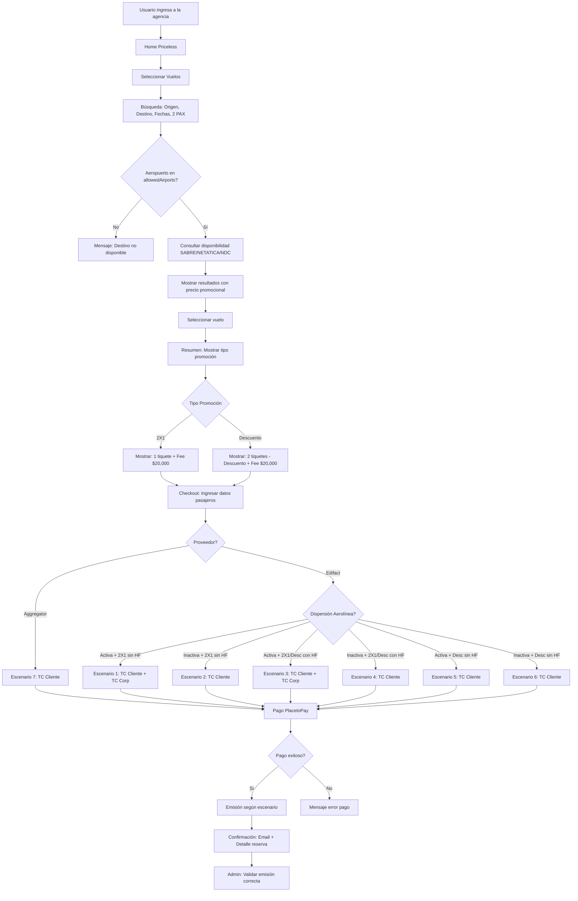
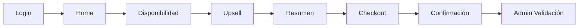
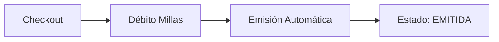
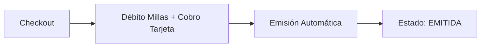

# 🛫 PRICELESS 2X1 - VUELOS

**Marketplace:** Mastercard Priceless 2X1  
**Producto:** Vuelos  
**Framework:** Angular  
**Proveedores:** SABRE Edifact, AGGREGATOR NETATICA, AGGREGATOR SABRE NDC  
**URL Test:** https://test-skynet-pmc.smartlinks.dev/es-co  
**URL Demo:** https://demo-skynet-pmc.smartlinks.dev/es-co  
**URL Prod:** https://vuelaconoccidente.com/es-co

---

## 📋 Información General

**Características:**
- ✅ Promociones: 2X1 o Descuento
- ✅ Fee Transaccional: Configurable en el Admin, por lo general $10,000 COP por pasajero (2 PAX = $20,000 COP)
- ✅ Fee Oculto: Variable según aerolínea/proveedor
- ✅ Dispersión: Condicional según aerolínea
- ✅ Aeropuertos Permitidos: Collection `allowedAirports` (MongoDB)
- ✅ 7 Escenarios de Pago/Emisión

**Tipos de Vuelo:**
- Ida y Vuelta (Round Trip)
- Solo Ida (One Way)
- Multidestino (Multi-City) - Si aplica

**Restricciones:**
- 🔴 Solo aeropuertos incluidos en `allowedAirports`
- 🔴 Obligatorio 2 pasajeros (para aplicar promoción)
- 🔴 Promoción aplicable solo para ciertos destinos/aerolíneas

---

## 🏗️ Arquitectura

### Proveedores

| Proveedor | Tipo | Dispersión | Fee Oculto | Escenarios Aplicables |
|-----------|------|------------|------------|----------------------|
| **SABRE Directo** | Edifact | Depende aerolínea | Variable | 1, 2, 5, 6 |
| **AGGREGATOR NETATICA** | Aggregator | ❌ No | ❌ No | 7 |
| **AGGREGATOR SABRE NDC** | Aggregator | ❌ No | ❌ No | 7 |

### Framework: Angular

**Componentes principales:**
- `flight-search.component` - Buscador de vuelos
- `flight-results.component` - Resultados de búsqueda
- `flight-detail.component` - Detalle del vuelo
- `flight-checkout.component` - Checkout y pago
- `flight-confirmation.component` - Confirmación de reserva

---

## 🔄 Flujo E2E - Vuelos



---

## 🎯 Pantallas del Flujo

### 1. **Usuario ingresa al marketplace (no hay Login)**
- Usuairo ingresa al marketplace

### 2. **Home**
- Selector de producto: Vuelos, Hoteles, Autos
- Banner promocional Priceless 2X1
- **⚠️ Acceso directo:** NO requiere login/registro

### 2. **Búsqueda Vuelos**
- Tipo de vuelo: Ida y vuelta / Solo ida / Multidestino
- Origen (Aeropuerto)
- Destino (Aeropuerto)
- Fecha salida
- Fecha regreso (si aplica)
- Pasajeros: **FIJO 2 adultos** (obligatorio para promoción)
- Botón: Buscar

**Validaciones:**
- ✅ Origen ≠ Destino
- ✅ Fecha salida ≥ Hoy
- ✅ Fecha regreso > Fecha salida
- ✅ Pasajeros = 2 (obligatorio)
- ✅ Aeropuertos en `allowedAirports`

### 3. **Resultados**
- Lista de vuelos disponibles
- Por cada vuelo:
  - Aerolínea + logo
  - Horarios (salida/llegada)
  - Escalas
  - **Precio ORIGINAL (tachado)**
  - **Precio CON PROMOCIÓN (destacado)**
  - Tipo promoción: "2X1" o "Descuento $X"
  - Botón: Seleccionar

**Cálculo mostrado:**
- **2X1:** Precio = (Base + Taxes) × 1 + Fee $20,000
- **Descuento:** Precio = [(Base + Taxes) × 2 - Descuento] + Fee $20,000

### 4. **Detalle del Vuelo**
- Información completa del vuelo
- Políticas de equipaje
- Políticas de cancelación
- Desglose de precio:
  - Base (2 pasajeros o 1 según promoción)
  - Taxes
  - Descuento (si aplica)
  - Fee Transaccional: $20,000 COP
  - **Total a pagar**
- Botón: Continuar

### 5. **Datos de Pasajeros**
- Pasajero 1: Nombre, Apellido, Documento, Fecha nacimiento, Género
- Pasajero 2: Nombre, Apellido, Documento, Fecha nacimiento, Género
- Datos de contacto: Email, Teléfono
- Botón: Continuar a pago

**Validaciones:**
- ✅ Todos los campos obligatorios completos
- ✅ Formato de documento válido
- ✅ Fecha de nacimiento válida
- ✅ Email válido

### 6. **Checkout - Resumen y Pago**
- Resumen del vuelo
- Datos de pasajeros
- Desglose final de precio
- **Tipo de promoción aplicada**
- Términos y condiciones
- Botón: Pagar con PlacetoPay

### 7. **PlacetoPay**
- Redirige a pasarela PlacetoPay
- Usuario ingresa datos de tarjeta TC Cliente
- Sistema procesa pago según escenario (1-7)
- Si escenario requiere TC Corporativa → Se procesa automáticamente

### 8. **Confirmación**
- Mensaje: "¡Reserva exitosa!"
- Código de reserva
- Detalle de vuelos
- Datos de pasajeros
- Precio final pagado
- Email de confirmación enviado
- Botón: Ver mi reserva

### 9. **Admin - Validación**
- Acceso admin Priceless
- Buscar reserva por código
- Validar:
  - Estado: EMITIDA
  - Emisión según escenario correcto
  - Método de pago aplicado
  - Tiquetes generados correctamente

---

## 🔥 Validaciones Críticas por Escenario

### Escenario 1: Edifact - 2X1 SIN HF + Dispersión ACTIVA
**Promoción:** 2X1  
**Fee Oculto:** NO  
**Dispersión:** ACTIVA

**Validaciones:**
- ✅ Cliente paga solo 1 tiquete (no 2)
- ✅ Fee transaccional visible = $20,000 COP
- ✅ Pago 1: TC Cliente → (Base + Taxes) × 1 + $10,000
- ✅ Pago 2: TC Corporativa → (Base + Taxes) × 1 + $10,000
- ✅ Emisión 1er tiquete: TC Cliente
- ✅ Emisión 2do tiquete: TC Corporativa
- ✅ 2 transacciones visibles en admin

### Escenario 2: Edifact - 2X1 SIN HF + Dispersión INACTIVA
**Promoción:** 2X1  
**Fee Oculto:** NO  
**Dispersión:** INACTIVA

**Validaciones:**
- ✅ Cliente paga solo 1 tiquete (no 2)
- ✅ Fee transaccional visible = $20,000 COP
- ✅ Pago: TC Cliente → Total completo
- ✅ Emisión: 2 tiquetes CASH
- ✅ 1 transacción en admin

### Escenario 3: 2X1/Descuento CON HF + Dispersión ACTIVA
**Promoción:** 2X1 o Descuento  
**Fee Oculto:** SÍ  
**Dispersión:** ACTIVA

**Validaciones:**
- ✅ Fee oculto NO visible al usuario
- ✅ Pago 1: TC Cliente → Precio visible al usuario
- ✅ Pago 2: TC Corporativa → Fee oculto + (Base+Taxes) × 2
- ✅ Emisión: 2 tiquetes TC Corporativa
- ✅ 2 transacciones en admin

### Escenario 4: 2X1/Descuento CON HF + Dispersión INACTIVA
**Promoción:** 2X1 o Descuento  
**Fee Oculto:** SÍ  
**Dispersión:** INACTIVA

**Validaciones:**
- ✅ Fee oculto NO visible al usuario
- ✅ Pago: TC Cliente → Total visible
- ✅ Emisión: 2 tiquetes CASH
- ✅ 1 transacción en admin

### Escenario 5: Edifact - Descuento SIN HF + Dispersión ACTIVA
**Promoción:** Descuento  
**Fee Oculto:** NO  
**Dispersión:** ACTIVA

**Validaciones:**
- ✅ Descuento visible claramente
- ✅ Cliente paga 2 tiquetes con descuento
- ✅ Fee transaccional visible = $20,000 COP
- ✅ Pago: TC Cliente → Total con descuento
- ✅ Emisión 1er tiquete: TC Cliente
- ✅ Emisión 2do tiquete: CASH + TC Cliente
- ✅ Emisión mixta correcta

### Escenario 6: Edifact - Descuento SIN HF + Dispersión INACTIVA
**Promoción:** Descuento  
**Fee Oculto:** NO  
**Dispersión:** INACTIVA

**Validaciones:**
- ✅ Descuento visible claramente
- ✅ Cliente paga 2 tiquetes con descuento
- ✅ Fee transaccional visible = $20,000 COP
- ✅ Pago: TC Cliente → Total
- ✅ Emisión: 2 tiquetes CASH
- ✅ 1 transacción en admin

### Escenario 7: Aggregator (Netatica o Sabre NDC)
**Promoción:** 2X1 o Descuento  
**Fee Oculto:** NO  
**Dispersión:** N/A (No aplica)

**Validaciones:**
- ✅ Promoción aplicada correctamente
- ✅ Fee transaccional visible = $20,000 COP
- ✅ Pago: TC Cliente → Total completo
- ✅ Emisión: SIEMPRE CASH (2 tiquetes)
- ✅ 1 transacción en admin
- ✅ Sin dispersión (Aggregator no soporta)

---

## 🧪 Casos de Prueba Críticos

### CP001: Vuelo 2X1 - SABRE Edifact - Dispersión Activa - Sin Fee Oculto
**Escenario:** 1  
**Prioridad:** 1 (Crítico)

**Precondiciones:**
- Aerolínea con dispersión ACTIVA
- Proveedor: SABRE Edifact
- Promoción: 2X1
- Fee Oculto: NO

**Pasos:**
1. Ingreso en martketplace Priceless
2. Seleccionar "Vuelos"
3. Ingresar búsqueda: BOG → MDE, 2 PAX, fechas válidas
4. Verificar aeropuertos en allowedAirports
5. Seleccionar vuelo disponible
6. Verificar precio mostrado = (Base + Taxes) × 1 + $20,000
7. Ingresar datos de 2 pasajeros
8. Continuar a pago
9. Pagar con TC Cliente
10. Verificar en admin: 2 transacciones (TC Cliente + TC Corporativa)
11. Verificar emisión: 1er tiquete TC Cliente, 2do tiquete TC Corporativa

**Resultado Esperado:**
- ✅ Promoción 2X1 aplicada (cliente paga 1)
- ✅ Fee $20,000 visible
- ✅ Pago procesado con 2 transacciones
- ✅ Emisión correcta según escenario 1

### CP002: Vuelo Descuento - SABRE Edifact - Dispersión Inactiva - Sin Fee Oculto
**Escenario:** 6  
**Prioridad:** 1 (Crítico)

**Precondiciones:**
- Aerolínea con dispersión INACTIVA
- Proveedor: SABRE Edifact
- Promoción: Descuento
- Fee Oculto: NO

**Pasos:**
1. Ingreso en portal Priceless
2. Seleccionar "Vuelos"
3. Ingresar búsqueda: BOG → CTG, 2 PAX, fechas válidas
4. Seleccionar vuelo con descuento
5. Verificar descuento visible en resultados
6. Verificar precio = [(Base + Taxes) × 2 - Descuento] + $20,000
7. Ingresar datos de 2 pasajeros
8. Continuar a pago
9. Pagar con TC Cliente
10. Verificar en admin: 1 transacción TC Cliente (total)
11. Verificar emisión: 2 tiquetes CASH

**Resultado Esperado:**
- ✅ Descuento aplicado correctamente
- ✅ Cliente paga 2 tiquetes con descuento
- ✅ Fee $20,000 visible
- ✅ Emisión CASH (sin dispersión)

### CP003: Vuelo 2X1 - Aggregator Netatica
**Escenario:** 7  
**Prioridad:** 1 (Crítico)

**Precondiciones:**
- Proveedor: AGGREGATOR NETATICA
- Promoción: 2X1
- Dispersión: N/A

**Pasos:**
1. Ingreso en portal Priceless
2. Seleccionar "Vuelos"
3. Ingresar búsqueda que retorne Netatica
4. Seleccionar vuelo
5. Verificar precio 2X1 aplicado
6. Ingresar datos de 2 pasajeros
7. Continuar a pago
8. Pagar con TC Cliente
9. Verificar en admin: 1 transacción TC Cliente
10. Verificar emisión: 2 tiquetes CASH

**Resultado Esperado:**
- ✅ Promoción 2X1 aplicada
- ✅ Pago único TC Cliente
- ✅ Emisión CASH (Aggregator no soporta dispersión)

### CP004: Validación allowedAirports - Aeropuerto NO permitido
**Prioridad:** 1 (Crítico)

**Pasos:**
1. # 🎰 MRS Mastercard - Modelo Solo Millas o Millas + Plata

> Portal de redención Mastercard con modelo mixto: Slider de pago entre Millas y Plata (efectivo)

---

## 📋 Información General

| Campo | Valor |
|-------|-------|
| **Portal** | https://austec.smartlinks.dev/es-ec (Austro - Ecuador) |
| | https://ficsahonduras.smartlinks.dev/es-hn (Ficohsa - Honduras) |
| | https://ficsaguatemala.smartlinks.dev/es-gt (Ficohsa - Guatemala) |
| | https://ficsapanama.smartlinks.dev/es-pa (Ficohsa - Panamá) |
| | https://ficsanicaragua.smartlinks.dev/es-ni (Ficohsa - Nicaragua) |
| | https://cpn-mrs.smartlinks.dev/es-cr (Coopenae - Costa Rica) |
| **Clientes** | Austro, Ficohsa (multi-país), Coopenae |
| **País** | Ecuador, Honduras, Guatemala, Panamá, Nicaragua, Costa Rica |
| **Modelo de Negocio** | B2B2C |
| **Plataforma** | MRS (Mastercard Rewards System) |
| **Célula** | Skynet |
| **Prefijo** | [MRS] |
| **Agente QA** | MRS_QA_Assistant |

---

## 💰 Modelo de Negocio - Slider Millas + Plata

### 🎚️ Dos Opciones de Pago

**1. Solo Millas (100% millas)**
```
Pago:     100% MILLAS
Emisión:  AUTOMÁTICA ⚡
Tarjeta:  NO requerida
Proceso:  Sin intervención manual
```

**2. Millas + Plata (Pago Mixto) - Slider**
```
Pago:     MILLAS (slider %) + PLATA (tarjeta)
Emisión:  AUTOMÁTICA ⚡
Tarjeta:  REQUERIDA
Proceso:  Sin intervención manual
```

### 📊 Mínimos del Slider por Producto

⚠️ **IMPORTANTE:** Los mínimos del slider son **configurables desde el Admin MRS** por cada cliente.

| Producto | Mínimo Slider (Configurable) | Ejemplo Común |
|----------|------------------------------|---------------|
| 🛫 **Vuelos** | Configurable desde Admin | 2875 millas |
| 🏨 **Hoteles** | Configurable desde Admin | 20% del total |
| 🚗 **Autos** | Configurable desde Admin | 20% del total |
| 🎢 **Actividades** | Configurable desde Admin | 20% del total |
| 🎠 **Disney** | Configurable desde Admin | 20% del total |

**Nota:** Verificar la configuración actual en el Admin MRS del cliente antes de validar el slider en casos de prueba.

---

## 🔐 Autenticación SSO

MRS utiliza **Single Sign-On (SSO)** mediante SAML para autenticación de usuarios.

### Proceso de Login:

1. **Generar token SSO** via `security/api/saml/acs`
2. **Vigencia del token:** 24 horas (TTL 12h)
3. **Usar token** en URL de login: `https://[portal]/es-ec/auth?token={TOKEN}`

### Usuarios para Testing:

| Tipo | Código | Estado | Uso |
|------|--------|--------|-----|
| ✅ **Recomendado** | 001 | Good Standing | Usuarios activos |
| ⚠️ Opcional | 002 | New | Nuevos usuarios |
| ❌ No usar | 000, 003, 004, 005 | Otros estados | Inactivos/Bloqueados |

### Validación de Login Exitoso:

✅ Sin redirecciones externas  
✅ Sesión activa en DevTools  
✅ Endpoint users responde 200  

**📋 Documentación completa:** Ver [MRS_COMMON_RULES.md - Autenticación SSO](../../../shared/Reglas%20Marketplace/MRS_COMMON_RULES.md#-autenticación-sso-single-sign-on)

---

## 🗺️ Flujo E2E Completo

### Pantallas del Proceso (Todas las Transacciones)



**Descripción del Flujo:**

1. **Login**
   - Usuario ingresa credenciales o usa **SSO (Single Sign-On)**
   - **Autenticación SSO:** Token generado via `security/api/saml/acs` (vigencia 24h)
   - Tipos de usuario: **001 – Good Standing** (recomendado para testing)
   - Autenticación en MRS (Austro/Ficohsa/Coopenae)
   - Acceso a portal del cliente correspondiente
   - 📋 [Ver detalle autenticación SSO](../../../shared/Reglas%20Marketplace/MRS_COMMON_RULES.md#-autenticación-sso-single-sign-on)

2. **Home**
   - Pantalla inicial de búsqueda
   - Usuario selecciona producto (Vuelos, Hoteles, Autos, Actividades, Disney)
   - Ingresa criterios de búsqueda

3. **Disponibilidad**
   - Resultados de búsqueda
   - **Slider de Millas + Plata visible**
   - Usuario ajusta % de millas vs plata
   - Selección de opción

4. **Upsell**
   - Ofertas adicionales
   - Upgrades disponibles
   - Seguros, servicios extra

5. **Resumen**
   - Detalle completo de la selección
   - Resumen de costos
   - **Confirmación de slider:** Millas + Plata
   - Revisión antes de checkout

6. **Checkout**
   - Datos del pasajero/usuario
   - **Confirmación final de slider**
   - Datos de tarjeta (si es Millas + Plata)
   - Términos y condiciones

7. **Confirmación**
   - Código de reserva
   - Resumen de pago:
     - **Solo Millas:** Millas debitadas
     - **Millas + Plata:** Millas debitadas + Monto USD
   - Instrucciones siguientes pasos

8. **Admin - Validación de Reservas**
   - Ingreso al administrador MRS del cliente correspondiente
   - Búsqueda por código de reserva
   - Validaciones:
     - **Solo Millas (100%):** Estado EMITIDA automáticamente ✅
     - **Millas + Plata:** Estado EMITIDA automáticamente ✅

---

## �🔄 Proceso de Emisión

### ✅ Emisión Automática (Solo Millas)



**Características:**
- ✅ Sin intervención manual
- ✅ Estado EMITIDA inmediato
- ✅ Usuario recibe confirmación al instante

### 🔧 Emisión Automática (Millas + Plata)



**Características:**
- ✅ Sin intervención manual
- ✅ Estado EMITIDA inmediato
- ✅ Usuario recibe confirmación al instante
- ✅ Débito de millas y cobro en tarjeta procesados automáticamente

---

## 📦 Productos y Proveedores

### 🛫 Vuelos
- **AGGREGATOR - NETACTICA** (sin dispersión de fondos)
- **AGGREGATOR - SABRE** (sin dispersión de fondos)
- **SABRE EDIFACT** (sin dispersión de fondos)
- Slider mínimo: 2875 millas

### 🏨 Hoteles
- **Hotel Sabre**
- Slider mínimo: 20%

### 🚗 Autos
- **Proveedor:** Sabre
- **Empresas:** Hertz, Dollar, Thrifty
- Slider mínimo: 20%

### 🎢 Actividades
- **HotelBeds**
- Slider mínimo: 20%

### 🎠 Disney
- **OffLine**
- Slider mínimo: 20%

---

## ✅ Validaciones Críticas

### Slider de Pago
- ✅ Visible en pantalla de disponibilidad
- ✅ Respeta mínimo por producto
- ✅ NO permite bajar del mínimo
- ✅ Cálculo correcto: Total = Millas + Plata
- ✅ Movimiento del slider funcional

### Checkout
- ✅ Campos obligatorios completos
- ✅ Tarjeta requerida solo en Millas + Plata
- ✅ Términos y condiciones aceptados
- ✅ Débito de millas según slider
- ✅ Botón de compra habilitado correctamente

### Confirmación
- ✅ Código de reserva visible
- ✅ Resumen de pagos (millas y/o plata)
- ✅ Valores consistentes con checkout

### Admin MRS
- ✅ Reserva localizable por código
- ✅ Solo Millas: Estado EMITIDA automáticamente
- ✅ Millas + Plata: Estado EMITIDA automáticamente
- ✅ Validar débito de millas y cobro procesados correctamente
- ✅ Acceso al admin del cliente correspondiente (Austro/Ficohsa/Coopenae)

---

## 🔄 Proceso de Cancelación

### Cancelar Reserva EMITIDA (Solo Millas o Millas + Plata)

**Estado inicial:** EMITIDA

**Pasos:**
1. Ingresar al admin MRS del cliente correspondiente
2. Buscar reserva por código
3. Click en "Cancelar" (según políticas del producto)
4. Confirmar cancelación
5. Sistema devuelve millas automáticamente (según políticas)
6. Sistema reversa cobro en tarjeta si fue Millas + Plata (según políticas)
7. Estado final: CANCELADO

**Validaciones:**
- ✅ Reserva estaba EMITIDA (emisión automática)
- ✅ Millas devueltas según políticas de cancelación
- ✅ Reverso de cobro en tarjeta si aplica
- ✅ Usuario puede reutilizar las millas (si se devolvieron)

---

## 📊 Matriz de Estados

| Modelo de Pago | Estado Inicial | Proceso | Estado Final |
|----------------|----------------|---------|--------------|
| **Solo Millas** | EMITIDA | Automático | EMITIDA |
| **Millas + Plata** | EMITIDA | Automático | EMITIDA |
| **Cancelada** | EMITIDA | Cancelar desde admin | CANCELADO |

---

## 🎯 Diferencias Clave vs Pichincha Miles (PM)

| Aspecto | MRS (Mastercard) | Pichincha Miles |
|---------|------------------|-----------------|
| **Modelo** | Slider Millas + Plata | 100% Millas fijo |
| **Opciones** | 100% Millas o Mixto | Solo 100% Millas |
| **Fee Vuelos** | ❌ No | ✅ Sí |
| **Emisión 100%** | Automática | Automática |
| **Emisión Mixta** | Automática | N/A |
| **Tarjeta** | Opcional (solo mixto) | Obligatoria (fee) |
| **Proceso** | Totalmente automático | Más simple |
| **Estados** | Más variados | Menos estados |
| **Pago efectivo** | ✅ Sí (mixto) | ❌ No |
| **Clientes** | Austro, Ficohsa, Coopenae | Pichincha |

---

## 📚 Documentación de Referencia

**Reglas de Negocio:**
- [MRS_COMMON_RULES.md](../../../shared/Reglas%20Marketplace/MRS_COMMON_RULES.md) - Reglas comunes MRS
- [Autenticación SSO](../../../shared/Reglas%20Marketplace/MRS_COMMON_RULES.md#-autenticación-sso-single-sign-on) - Proceso de login SSO

**Flujos por Producto:**
- [MRS_VUELOS.md](MRS_VUELOS.md) - Flujo E2E Vuelos
- [MRS_HOTELES.md](MRS_HOTELES.md) - Flujo E2E Hoteles
- [MRS_AUTOS.md](MRS_AUTOS.md) - Flujo E2E Autos
- [MRS_ACTIVIDADES.md](MRS_ACTIVIDADES.md) - Flujo E2E Actividades
- [MRS_DISNEY.md](MRS_DISNEY.md) - Flujo E2E Disney

**Autenticación y Seguridad:**
- [Wiki: Login SSO Mastercard MRS](https://dev.azure.com/ultragrouplaorg/ultragroupla/_wiki/wikis/Ultra%20Group%20Wiki/1342/Login-SSO-Mastercard-MRS-Generación-Token) - Guía completa de generación de token SSO
- Colección Postman: MasterCard - MRS.postman_collection.json

**Agente QA:**
- [MRS_QA_Assistant](../../../agents/MRS_QA_Assistant.agent.md) - Agente especializado MRS

---

## 🚀 Testing

**Complejidad:** ALTA

**Razones:**
- Dos modelos de pago diferentes
- Emisión automática en ambos modelos
- Validación de slider
- Políticas de cancelación
- Cancelaciones con devolución de millas

**Casos Críticos:**
1. Validar slider en todos los productos (mínimos específicos)
2. Probar emisión automática (100% millas)
3. Probar emisión automática (millas + plata)
4. Validar cancelaciones con políticas de devolución
5. Verificar cálculos de millas y plata
6. Probar todos los proveedores (NETACTICA, SABRE, Hotel Sabre, etc.)
7. Validar acceso a cada admin por cliente (Austro, Ficohsa, Coopenae)
8. Validar estado EMITIDA inmediato en ambos modelos de pago

---

## 📞 Contacto

**Agente QA:** MRS_QA_Assistant  
**Ubicación:** `.github/agents/MRS_QA_Assistant.agent.md`

**Para:**
- Crear casos de prueba MRS
- Análisis de HU MRS
- Consultas técnicas MRS
- Trabajo con portales Austro, Ficohsa y Coopenae

---

**Última actualización:** 2026-01-08  
**Versión:** 1.0  
**Estado:** ✅ Activo

 en portal Priceless
2. Seleccionar "Vuelos"
3. Ingresar búsqueda con aeropuerto NO en allowedAirports
4. Click en Buscar

**Resultado Esperado:**
- ❌ No se muestran resultados
- ⚠️ Mensaje: "Destino no disponible en este momento"
- ⚠️ Sugerencia de destinos permitidos (opcional)

### CP005: Validación 2 Pasajeros Obligatorios
**Prioridad:** 2

**Pasos:**
1. # 🎰 MRS Mastercard - Modelo Solo Millas o Millas + Plata

> Portal de redención Mastercard con modelo mixto: Slider de pago entre Millas y Plata (efectivo)

---

## 📋 Información General

| Campo | Valor |
|-------|-------|
| **Portal** | https://austec.smartlinks.dev/es-ec (Austro - Ecuador) |
| | https://ficsahonduras.smartlinks.dev/es-hn (Ficohsa - Honduras) |
| | https://ficsaguatemala.smartlinks.dev/es-gt (Ficohsa - Guatemala) |
| | https://ficsapanama.smartlinks.dev/es-pa (Ficohsa - Panamá) |
| | https://ficsanicaragua.smartlinks.dev/es-ni (Ficohsa - Nicaragua) |
| | https://cpn-mrs.smartlinks.dev/es-cr (Coopenae - Costa Rica) |
| **Clientes** | Austro, Ficohsa (multi-país), Coopenae |
| **País** | Ecuador, Honduras, Guatemala, Panamá, Nicaragua, Costa Rica |
| **Modelo de Negocio** | B2B2C |
| **Plataforma** | MRS (Mastercard Rewards System) |
| **Célula** | Skynet |
| **Prefijo** | [MRS] |
| **Agente QA** | MRS_QA_Assistant |

---

## 💰 Modelo de Negocio - Slider Millas + Plata

### 🎚️ Dos Opciones de Pago

**1. Solo Millas (100% millas)**
```
Pago:     100% MILLAS
Emisión:  AUTOMÁTICA ⚡
Tarjeta:  NO requerida
Proceso:  Sin intervención manual
```

**2. Millas + Plata (Pago Mixto) - Slider**
```
Pago:     MILLAS (slider %) + PLATA (tarjeta)
Emisión:  AUTOMÁTICA ⚡
Tarjeta:  REQUERIDA
Proceso:  Sin intervención manual
```

### 📊 Mínimos del Slider por Producto

⚠️ **IMPORTANTE:** Los mínimos del slider son **configurables desde el Admin MRS** por cada cliente.

| Producto | Mínimo Slider (Configurable) | Ejemplo Común |
|----------|------------------------------|---------------|
| 🛫 **Vuelos** | Configurable desde Admin | 2875 millas |
| 🏨 **Hoteles** | Configurable desde Admin | 20% del total |
| 🚗 **Autos** | Configurable desde Admin | 20% del total |
| 🎢 **Actividades** | Configurable desde Admin | 20% del total |
| 🎠 **Disney** | Configurable desde Admin | 20% del total |

**Nota:** Verificar la configuración actual en el Admin MRS del cliente antes de validar el slider en casos de prueba.

---

## 🔐 Autenticación SSO

MRS utiliza **Single Sign-On (SSO)** mediante SAML para autenticación de usuarios.

### Proceso de Login:

1. **Generar token SSO** via `security/api/saml/acs`
2. **Vigencia del token:** 24 horas (TTL 12h)
3. **Usar token** en URL de login: `https://[portal]/es-ec/auth?token={TOKEN}`

### Usuarios para Testing:

| Tipo | Código | Estado | Uso |
|------|--------|--------|-----|
| ✅ **Recomendado** | 001 | Good Standing | Usuarios activos |
| ⚠️ Opcional | 002 | New | Nuevos usuarios |
| ❌ No usar | 000, 003, 004, 005 | Otros estados | Inactivos/Bloqueados |

### Validación de Login Exitoso:

✅ Sin redirecciones externas  
✅ Sesión activa en DevTools  
✅ Endpoint users responde 200  

**📋 Documentación completa:** Ver [MRS_COMMON_RULES.md - Autenticación SSO](../../../shared/Reglas%20Marketplace/MRS_COMMON_RULES.md#-autenticación-sso-single-sign-on)

---

## 🗺️ Flujo E2E Completo

### Pantallas del Proceso (Todas las Transacciones)


**Descripción del Flujo:**

1. **Login**
   - Usuario ingresa credenciales o usa **SSO (Single Sign-On)**
   - **Autenticación SSO:** Token generado via `security/api/saml/acs` (vigencia 24h)
   - Tipos de usuario: **001 – Good Standing** (recomendado para testing)
   - Autenticación en MRS (Austro/Ficohsa/Coopenae)
   - Acceso a portal del cliente correspondiente
   - 📋 [Ver detalle autenticación SSO](../../../shared/Reglas%20Marketplace/MRS_COMMON_RULES.md#-autenticación-sso-single-sign-on)

2. **Home**
   - Pantalla inicial de búsqueda
   - Usuario selecciona producto (Vuelos, Hoteles, Autos, Actividades, Disney)
   - Ingresa criterios de búsqueda

3. **Disponibilidad**
   - Resultados de búsqueda
   - **Slider de Millas + Plata visible**
   - Usuario ajusta % de millas vs plata
   - Selección de opción

4. **Upsell**
   - Ofertas adicionales
   - Upgrades disponibles
   - Seguros, servicios extra

5. **Resumen**
   - Detalle completo de la selección
   - Resumen de costos
   - **Confirmación de slider:** Millas + Plata
   - Revisión antes de checkout

6. **Checkout**
   - Datos del pasajero/usuario
   - **Confirmación final de slider**
   - Datos de tarjeta (si es Millas + Plata)
   - Términos y condiciones

7. **Confirmación**
   - Código de reserva
   - Resumen de pago:
     - **Solo Millas:** Millas debitadas
     - **Millas + Plata:** Millas debitadas + Monto USD
   - Instrucciones siguientes pasos

8. **Admin - Validación de Reservas**
   - Ingreso al administrador MRS del cliente correspondiente
   - Búsqueda por código de reserva
   - Validaciones:
     - **Solo Millas (100%):** Estado EMITIDA automáticamente ✅
     - **Millas + Plata:** Estado EMITIDA automáticamente ✅

---

## �🔄 Proceso de Emisión

### ✅ Emisión Automática (Solo Millas)


**Características:**
- ✅ Sin intervención manual
- ✅ Estado EMITIDA inmediato
- ✅ Usuario recibe confirmación al instante

### 🔧 Emisión Automática (Millas + Plata)


**Características:**
- ✅ Sin intervención manual
- ✅ Estado EMITIDA inmediato
- ✅ Usuario recibe confirmación al instante
- ✅ Débito de millas y cobro en tarjeta procesados automáticamente

---

## 📦 Productos y Proveedores

### 🛫 Vuelos
- **AGGREGATOR - NETACTICA** (sin dispersión de fondos)
- **AGGREGATOR - SABRE** (sin dispersión de fondos)
- **SABRE EDIFACT** (sin dispersión de fondos)
- Slider mínimo: 2875 millas

### 🏨 Hoteles
- **Hotel Sabre**
- Slider mínimo: 20%

### 🚗 Autos
- **Proveedor:** Sabre
- **Empresas:** Hertz, Dollar, Thrifty
- Slider mínimo: 20%

### 🎢 Actividades
- **HotelBeds**
- Slider mínimo: 20%

### 🎠 Disney
- **OffLine**
- Slider mínimo: 20%

---

## ✅ Validaciones Críticas

### Slider de Pago
- ✅ Visible en pantalla de disponibilidad
- ✅ Respeta mínimo por producto
- ✅ NO permite bajar del mínimo
- ✅ Cálculo correcto: Total = Millas + Plata
- ✅ Movimiento del slider funcional

### Checkout
- ✅ Campos obligatorios completos
- ✅ Tarjeta requerida solo en Millas + Plata
- ✅ Términos y condiciones aceptados
- ✅ Débito de millas según slider
- ✅ Botón de compra habilitado correctamente

### Confirmación
- ✅ Código de reserva visible
- ✅ Resumen de pagos (millas y/o plata)
- ✅ Valores consistentes con checkout

### Admin MRS
- ✅ Reserva localizable por código
- ✅ Solo Millas: Estado EMITIDA automáticamente
- ✅ Millas + Plata: Estado EMITIDA automáticamente
- ✅ Validar débito de millas y cobro procesados correctamente
- ✅ Acceso al admin del cliente correspondiente (Austro/Ficohsa/Coopenae)

---

## 🔄 Proceso de Cancelación

### Cancelar Reserva EMITIDA (Solo Millas o Millas + Plata)

**Estado inicial:** EMITIDA

**Pasos:**
1. Ingresar al admin MRS del cliente correspondiente
2. Buscar reserva por código
3. Click en "Cancelar" (según políticas del producto)
4. Confirmar cancelación
5. Sistema devuelve millas automáticamente (según políticas)
6. Sistema reversa cobro en tarjeta si fue Millas + Plata (según políticas)
7. Estado final: CANCELADO

**Validaciones:**
- ✅ Reserva estaba EMITIDA (emisión automática)
- ✅ Millas devueltas según políticas de cancelación
- ✅ Reverso de cobro en tarjeta si aplica
- ✅ Usuario puede reutilizar las millas (si se devolvieron)

---

## 📊 Matriz de Estados

| Modelo de Pago | Estado Inicial | Proceso | Estado Final |
|----------------|----------------|---------|--------------|
| **Solo Millas** | EMITIDA | Automático | EMITIDA |
| **Millas + Plata** | EMITIDA | Automático | EMITIDA |
| **Cancelada** | EMITIDA | Cancelar desde admin | CANCELADO |

---

## 🎯 Diferencias Clave vs Pichincha Miles (PM)

| Aspecto | MRS (Mastercard) | Pichincha Miles |
|---------|------------------|-----------------|
| **Modelo** | Slider Millas + Plata | 100% Millas fijo |
| **Opciones** | 100% Millas o Mixto | Solo 100% Millas |
| **Fee Vuelos** | ❌ No | ✅ Sí |
| **Emisión 100%** | Automática | Automática |
| **Emisión Mixta** | Automática | N/A |
| **Tarjeta** | Opcional (solo mixto) | Obligatoria (fee) |
| **Proceso** | Totalmente automático | Más simple |
| **Estados** | Más variados | Menos estados |
| **Pago efectivo** | ✅ Sí (mixto) | ❌ No |
| **Clientes** | Austro, Ficohsa, Coopenae | Pichincha |

---

## 📚 Documentación de Referencia

**Reglas de Negocio:**
- [MRS_COMMON_RULES.md](../../../shared/Reglas%20Marketplace/MRS_COMMON_RULES.md) - Reglas comunes MRS
- [Autenticación SSO](../../../shared/Reglas%20Marketplace/MRS_COMMON_RULES.md#-autenticación-sso-single-sign-on) - Proceso de login SSO

**Flujos por Producto:**
- [MRS_VUELOS.md](MRS_VUELOS.md) - Flujo E2E Vuelos
- [MRS_HOTELES.md](MRS_HOTELES.md) - Flujo E2E Hoteles
- [MRS_AUTOS.md](MRS_AUTOS.md) - Flujo E2E Autos
- [MRS_ACTIVIDADES.md](MRS_ACTIVIDADES.md) - Flujo E2E Actividades
- [MRS_DISNEY.md](MRS_DISNEY.md) - Flujo E2E Disney

**Autenticación y Seguridad:**
- [Wiki: Login SSO Mastercard MRS](https://dev.azure.com/ultragrouplaorg/ultragroupla/_wiki/wikis/Ultra%20Group%20Wiki/1342/Login-SSO-Mastercard-MRS-Generación-Token) - Guía completa de generación de token SSO
- Colección Postman: MasterCard - MRS.postman_collection.json

**Agente QA:**
- [MRS_QA_Assistant](../../../agents/MRS_QA_Assistant.agent.md) - Agente especializado MRS

---

## 🚀 Testing

**Complejidad:** ALTA

**Razones:**
- Dos modelos de pago diferentes
- Emisión automática en ambos modelos
- Validación de slider
- Políticas de cancelación
- Cancelaciones con devolución de millas

**Casos Críticos:**
1. Validar slider en todos los productos (mínimos específicos)
2. Probar emisión automática (100% millas)
3. Probar emisión automática (millas + plata)
4. Validar cancelaciones con políticas de devolución
5. Verificar cálculos de millas y plata
6. Probar todos los proveedores (NETACTICA, SABRE, Hotel Sabre, etc.)
7. Validar acceso a cada admin por cliente (Austro, Ficohsa, Coopenae)
8. Validar estado EMITIDA inmediato en ambos modelos de pago

---

## 📞 Contacto

**Agente QA:** MRS_QA_Assistant  
**Ubicación:** `.github/agents/MRS_QA_Assistant.agent.md`

**Para:**
- Crear casos de prueba MRS
- Análisis de HU MRS
- Consultas técnicas MRS
- Trabajo con portales Austro, Ficohsa y Coopenae

---

**Última actualización:** 2026-01-08  
**Versión:** 1.0  
**Estado:** ✅ Activo

 en portal Priceless
2. Seleccionar "Vuelos"
3. Intentar modificar cantidad de pasajeros a 1 o 3+

**Resultado Esperado:**
- 🔒 Selector de pasajeros bloqueado en 2
- ⚠️ Mensaje: "Promoción válida para 2 pasajeros únicamente"

### CP006: Vuelo 2X1 con Fee Oculto - Dispersión Activa
**Escenario:** 3  
**Prioridad:** 1 (Crítico)

**Precondiciones:**
- Aerolínea con dispersión ACTIVA
- Promoción: 2X1
- Fee Oculto: SÍ

**Pasos:**
1. # 🎰 MRS Mastercard - Modelo Solo Millas o Millas + Plata

> Portal de redención Mastercard con modelo mixto: Slider de pago entre Millas y Plata (efectivo)

---

## 📋 Información General

| Campo | Valor |
|-------|-------|
| **Portal** | https://austec.smartlinks.dev/es-ec (Austro - Ecuador) |
| | https://ficsahonduras.smartlinks.dev/es-hn (Ficohsa - Honduras) |
| | https://ficsaguatemala.smartlinks.dev/es-gt (Ficohsa - Guatemala) |
| | https://ficsapanama.smartlinks.dev/es-pa (Ficohsa - Panamá) |
| | https://ficsanicaragua.smartlinks.dev/es-ni (Ficohsa - Nicaragua) |
| | https://cpn-mrs.smartlinks.dev/es-cr (Coopenae - Costa Rica) |
| **Clientes** | Austro, Ficohsa (multi-país), Coopenae |
| **País** | Ecuador, Honduras, Guatemala, Panamá, Nicaragua, Costa Rica |
| **Modelo de Negocio** | B2B2C |
| **Plataforma** | MRS (Mastercard Rewards System) |
| **Célula** | Skynet |
| **Prefijo** | [MRS] |
| **Agente QA** | MRS_QA_Assistant |

---

## 💰 Modelo de Negocio - Slider Millas + Plata

### 🎚️ Dos Opciones de Pago

**1. Solo Millas (100% millas)**
```
Pago:     100% MILLAS
Emisión:  AUTOMÁTICA ⚡
Tarjeta:  NO requerida
Proceso:  Sin intervención manual
```

**2. Millas + Plata (Pago Mixto) - Slider**
```
Pago:     MILLAS (slider %) + PLATA (tarjeta)
Emisión:  AUTOMÁTICA ⚡
Tarjeta:  REQUERIDA
Proceso:  Sin intervención manual
```

### 📊 Mínimos del Slider por Producto

⚠️ **IMPORTANTE:** Los mínimos del slider son **configurables desde el Admin MRS** por cada cliente.

| Producto | Mínimo Slider (Configurable) | Ejemplo Común |
|----------|------------------------------|---------------|
| 🛫 **Vuelos** | Configurable desde Admin | 2875 millas |
| 🏨 **Hoteles** | Configurable desde Admin | 20% del total |
| 🚗 **Autos** | Configurable desde Admin | 20% del total |
| 🎢 **Actividades** | Configurable desde Admin | 20% del total |
| 🎠 **Disney** | Configurable desde Admin | 20% del total |

**Nota:** Verificar la configuración actual en el Admin MRS del cliente antes de validar el slider en casos de prueba.

---

## 🔐 Autenticación SSO

MRS utiliza **Single Sign-On (SSO)** mediante SAML para autenticación de usuarios.

### Proceso de Login:

1. **Generar token SSO** via `security/api/saml/acs`
2. **Vigencia del token:** 24 horas (TTL 12h)
3. **Usar token** en URL de login: `https://[portal]/es-ec/auth?token={TOKEN}`

### Usuarios para Testing:

| Tipo | Código | Estado | Uso |
|------|--------|--------|-----|
| ✅ **Recomendado** | 001 | Good Standing | Usuarios activos |
| ⚠️ Opcional | 002 | New | Nuevos usuarios |
| ❌ No usar | 000, 003, 004, 005 | Otros estados | Inactivos/Bloqueados |

### Validación de Login Exitoso:

✅ Sin redirecciones externas  
✅ Sesión activa en DevTools  
✅ Endpoint users responde 200  

**📋 Documentación completa:** Ver [MRS_COMMON_RULES.md - Autenticación SSO](../../../shared/Reglas%20Marketplace/MRS_COMMON_RULES.md#-autenticación-sso-single-sign-on)

---

## 🗺️ Flujo E2E Completo

### Pantallas del Proceso (Todas las Transacciones)


**Descripción del Flujo:**

1. **Login**
   - Usuario ingresa credenciales o usa **SSO (Single Sign-On)**
   - **Autenticación SSO:** Token generado via `security/api/saml/acs` (vigencia 24h)
   - Tipos de usuario: **001 – Good Standing** (recomendado para testing)
   - Autenticación en MRS (Austro/Ficohsa/Coopenae)
   - Acceso a portal del cliente correspondiente
   - 📋 [Ver detalle autenticación SSO](../../../shared/Reglas%20Marketplace/MRS_COMMON_RULES.md#-autenticación-sso-single-sign-on)

2. **Home**
   - Pantalla inicial de búsqueda
   - Usuario selecciona producto (Vuelos, Hoteles, Autos, Actividades, Disney)
   - Ingresa criterios de búsqueda

3. **Disponibilidad**
   - Resultados de búsqueda
   - **Slider de Millas + Plata visible**
   - Usuario ajusta % de millas vs plata
   - Selección de opción

4. **Upsell**
   - Ofertas adicionales
   - Upgrades disponibles
   - Seguros, servicios extra

5. **Resumen**
   - Detalle completo de la selección
   - Resumen de costos
   - **Confirmación de slider:** Millas + Plata
   - Revisión antes de checkout

6. **Checkout**
   - Datos del pasajero/usuario
   - **Confirmación final de slider**
   - Datos de tarjeta (si es Millas + Plata)
   - Términos y condiciones

7. **Confirmación**
   - Código de reserva
   - Resumen de pago:
     - **Solo Millas:** Millas debitadas
     - **Millas + Plata:** Millas debitadas + Monto USD
   - Instrucciones siguientes pasos

8. **Admin - Validación de Reservas**
   - Ingreso al administrador MRS del cliente correspondiente
   - Búsqueda por código de reserva
   - Validaciones:
     - **Solo Millas (100%):** Estado EMITIDA automáticamente ✅
     - **Millas + Plata:** Estado EMITIDA automáticamente ✅

---

## �🔄 Proceso de Emisión

### ✅ Emisión Automática (Solo Millas)


**Características:**
- ✅ Sin intervención manual
- ✅ Estado EMITIDA inmediato
- ✅ Usuario recibe confirmación al instante

### 🔧 Emisión Automática (Millas + Plata)


**Características:**
- ✅ Sin intervención manual
- ✅ Estado EMITIDA inmediato
- ✅ Usuario recibe confirmación al instante
- ✅ Débito de millas y cobro en tarjeta procesados automáticamente

---

## 📦 Productos y Proveedores

### 🛫 Vuelos
- **AGGREGATOR - NETACTICA** (sin dispersión de fondos)
- **AGGREGATOR - SABRE** (sin dispersión de fondos)
- **SABRE EDIFACT** (sin dispersión de fondos)
- Slider mínimo: 2875 millas

### 🏨 Hoteles
- **Hotel Sabre**
- Slider mínimo: 20%

### 🚗 Autos
- **Proveedor:** Sabre
- **Empresas:** Hertz, Dollar, Thrifty
- Slider mínimo: 20%

### 🎢 Actividades
- **HotelBeds**
- Slider mínimo: 20%

### 🎠 Disney
- **OffLine**
- Slider mínimo: 20%

---

## ✅ Validaciones Críticas

### Slider de Pago
- ✅ Visible en pantalla de disponibilidad
- ✅ Respeta mínimo por producto
- ✅ NO permite bajar del mínimo
- ✅ Cálculo correcto: Total = Millas + Plata
- ✅ Movimiento del slider funcional

### Checkout
- ✅ Campos obligatorios completos
- ✅ Tarjeta requerida solo en Millas + Plata
- ✅ Términos y condiciones aceptados
- ✅ Débito de millas según slider
- ✅ Botón de compra habilitado correctamente

### Confirmación
- ✅ Código de reserva visible
- ✅ Resumen de pagos (millas y/o plata)
- ✅ Valores consistentes con checkout

### Admin MRS
- ✅ Reserva localizable por código
- ✅ Solo Millas: Estado EMITIDA automáticamente
- ✅ Millas + Plata: Estado EMITIDA automáticamente
- ✅ Validar débito de millas y cobro procesados correctamente
- ✅ Acceso al admin del cliente correspondiente (Austro/Ficohsa/Coopenae)

---

## 🔄 Proceso de Cancelación

### Cancelar Reserva EMITIDA (Solo Millas o Millas + Plata)

**Estado inicial:** EMITIDA

**Pasos:**
1. Ingresar al admin MRS del cliente correspondiente
2. Buscar reserva por código
3. Click en "Cancelar" (según políticas del producto)
4. Confirmar cancelación
5. Sistema devuelve millas automáticamente (según políticas)
6. Sistema reversa cobro en tarjeta si fue Millas + Plata (según políticas)
7. Estado final: CANCELADO

**Validaciones:**
- ✅ Reserva estaba EMITIDA (emisión automática)
- ✅ Millas devueltas según políticas de cancelación
- ✅ Reverso de cobro en tarjeta si aplica
- ✅ Usuario puede reutilizar las millas (si se devolvieron)

---

## 📊 Matriz de Estados

| Modelo de Pago | Estado Inicial | Proceso | Estado Final |
|----------------|----------------|---------|--------------|
| **Solo Millas** | EMITIDA | Automático | EMITIDA |
| **Millas + Plata** | EMITIDA | Automático | EMITIDA |
| **Cancelada** | EMITIDA | Cancelar desde admin | CANCELADO |

---

## 🎯 Diferencias Clave vs Pichincha Miles (PM)

| Aspecto | MRS (Mastercard) | Pichincha Miles |
|---------|------------------|-----------------|
| **Modelo** | Slider Millas + Plata | 100% Millas fijo |
| **Opciones** | 100% Millas o Mixto | Solo 100% Millas |
| **Fee Vuelos** | ❌ No | ✅ Sí |
| **Emisión 100%** | Automática | Automática |
| **Emisión Mixta** | Automática | N/A |
| **Tarjeta** | Opcional (solo mixto) | Obligatoria (fee) |
| **Proceso** | Totalmente automático | Más simple |
| **Estados** | Más variados | Menos estados |
| **Pago efectivo** | ✅ Sí (mixto) | ❌ No |
| **Clientes** | Austro, Ficohsa, Coopenae | Pichincha |

---

## 📚 Documentación de Referencia

**Reglas de Negocio:**
- [MRS_COMMON_RULES.md](../../../shared/Reglas%20Marketplace/MRS_COMMON_RULES.md) - Reglas comunes MRS
- [Autenticación SSO](../../../shared/Reglas%20Marketplace/MRS_COMMON_RULES.md#-autenticación-sso-single-sign-on) - Proceso de login SSO

**Flujos por Producto:**
- [MRS_VUELOS.md](MRS_VUELOS.md) - Flujo E2E Vuelos
- [MRS_HOTELES.md](MRS_HOTELES.md) - Flujo E2E Hoteles
- [MRS_AUTOS.md](MRS_AUTOS.md) - Flujo E2E Autos
- [MRS_ACTIVIDADES.md](MRS_ACTIVIDADES.md) - Flujo E2E Actividades
- [MRS_DISNEY.md](MRS_DISNEY.md) - Flujo E2E Disney

**Autenticación y Seguridad:**
- [Wiki: Login SSO Mastercard MRS](https://dev.azure.com/ultragrouplaorg/ultragroupla/_wiki/wikis/Ultra%20Group%20Wiki/1342/Login-SSO-Mastercard-MRS-Generación-Token) - Guía completa de generación de token SSO
- Colección Postman: MasterCard - MRS.postman_collection.json

**Agente QA:**
- [MRS_QA_Assistant](../../../agents/MRS_QA_Assistant.agent.md) - Agente especializado MRS

---

## 🚀 Testing

**Complejidad:** ALTA

**Razones:**
- Dos modelos de pago diferentes
- Emisión automática en ambos modelos
- Validación de slider
- Políticas de cancelación
- Cancelaciones con devolución de millas

**Casos Críticos:**
1. Validar slider en todos los productos (mínimos específicos)
2. Probar emisión automática (100% millas)
3. Probar emisión automática (millas + plata)
4. Validar cancelaciones con políticas de devolución
5. Verificar cálculos de millas y plata
6. Probar todos los proveedores (NETACTICA, SABRE, Hotel Sabre, etc.)
7. Validar acceso a cada admin por cliente (Austro, Ficohsa, Coopenae)
8. Validar estado EMITIDA inmediato en ambos modelos de pago

---

## 📞 Contacto

**Agente QA:** MRS_QA_Assistant  
**Ubicación:** `.github/agents/MRS_QA_Assistant.agent.md`

**Para:**
- Crear casos de prueba MRS
- Análisis de HU MRS
- Consultas técnicas MRS
- Trabajo con portales Austro, Ficohsa y Coopenae

---

**Última actualización:** 2026-01-08  
**Versión:** 1.0  
**Estado:** ✅ Activo

 en portal Priceless
2. Seleccionar vuelo con fee oculto
3. Verificar que fee oculto NO sea visible al usuario
4. Ingresar datos de 2 pasajeros
5. Continuar a pago
6. Pagar con TC Cliente (solo precio visible)
7. Verificar en admin: 2 transacciones (TC Cliente + TC Corporativa)
8. Verificar que TC Corporativa cubrió fee oculto + 2 tiquetes
9. Verificar emisión: 2 tiquetes TC Corporativa

**Resultado Esperado:**
- ✅ Fee oculto NO visible al usuario
- ✅ TC Corporativa procesa fee oculto
- ✅ Emisión correcta con TC Corporativa

### CP007: Cancelación Vuelo - Escenario 1 (Dispersión Activa)
**Prioridad:** 2

**Precondiciones:**
- Reserva EMITIDA según escenario 1

**Pasos:**
1. Ingresar al admin Priceless
2. Buscar reserva por código
3. Click en "Cancelar"
4. Confirmar cancelación
5. Verificar estado = CANCELADO en el sistema
6. **Equipo de operaciones ejecuta reversos manualmente:**
   - Reverso TC Cliente (proceso manual)
   - Reverso TC Corporativa (proceso manual)
7. Validar reembolsos procesados según políticas

**Resultado Esperado:**
- ✅ Estado actualizado a CANCELADO
- ⚠️ **Reversos NO automáticos:** Ejecutados manualmente por operaciones
- ✅ Reverso TC Cliente procesado (manual)
- ✅ Reverso TC Corporativa procesado (manual)
- ✅ Fee transaccional reembolsado (según políticas)
- ✅ Cliente notificado de cancelación

### CP008: Vuelo Multidestino (si aplica)
**Prioridad:** 3

**Pasos:**
1. Ingresar a portal Priceless (sin login requerido)
2. Seleccionar "Multidestino"
3. Configurar: BOG → MDE → CTG → BOG
4. 2 PAX, fechas válidas
5. Buscar disponibilidad
6. Verificar aplicación de promoción
7. Completar reserva

**Resultado Esperado:**
- ✅ Promoción aplicada en multidestino
- ✅ Cálculo correcto para 2 PAX
- ✅ Emisión según escenario aplicable

---

## 📊 Matriz de Cobertura

| Escenario | Promoción | Dispersión | Fee Oculto | Proveedor | Casos de Prueba |
|-----------|-----------|------------|------------|-----------|-----------------|
| 1 | 2X1 | Activa | No | SABRE | CP001 |
| 2 | 2X1 | Inactiva | No | SABRE | - |
| 3 | 2X1 | Activa | Sí | SABRE | CP006 |
| 4 | 2X1 | Inactiva | Sí | SABRE | - |
| 5 | Descuento | Activa | No | SABRE | - |
| 6 | Descuento | Inactiva | No | SABRE | CP002 |
| 7 | 2X1/Desc | N/A | No | Aggregator | CP003 |

**Cobertura adicional:**
- allowedAirports: CP004
- 2 Pasajeros obligatorio: CP005
- Cancelaciones: CP007
- Multidestino: CP008

---

## 🚨 Casos Borde y Excepciones

1. **Aeropuerto no en allowedAirports:**
   - Sistema NO muestra resultados
   - Mensaje claro al usuario

2. **Promoción NO disponible para ruta:**
   - Mostrar precio regular (sin promoción)
   - Indicar que promoción no aplica

3. **Disponibilidad 0:**
   - Mensaje: "No hay vuelos disponibles para estas fechas"
   - Sugerir fechas alternativas

4. **Error en PlacetoPay:**
   - Pago rechazado → No se emite reserva
   - Usuario puede reintentar

5. **Dispersión falla:**
   - Log de error en admin
   - Alertar a equipo de soporte
   - Intentar emisión manual

6. **Fee Oculto no procesado:**
   - Bloquear emisión
   - Alertar a equipo técnico
   - Resolver manualmente

7. **Cambio de precio entre búsqueda y checkout:**
   - Mostrar nuevo precio
   - Usuario debe aceptar antes de pagar

8. **Pasajero menor de edad:**
   - Validar edad mínima (según políticas)
   - Bloquear si no cumple requisitos

---

## 📚 Referencias

**Documentación:**
- [PRICELESS_COMMON_RULES.md](../../../shared/Reglas%20Marketplace/PRICELESS_COMMON_RULES.md)
- [README.MD](README.MD)
- [Wiki: Mastercard - Priceless 2X1](https://dev.azure.com/ultragrouplaorg/ultragroupla/_wiki/wikis/Ultra%20Group%20Wiki/1141/Mastercard-Priceless-2X1)
- [Excel: Calcular 2x1 o descuento.xlsx](https://smartlinksdev-my.sharepoint.com/:x:/r/personal/crubiog_ultragroupla_com/_layouts/15/Doc.aspx?sourcedoc=%7B64CBE898-E0F2-402B-88AB-1093813C7C49%7D)

**Agente:**
- [PRICELESS_QA_Assistant](../../../agents/PRICELESS_QA_Assistant.agent.md)

---

**Última actualización:** 2026-02-03  
**Versión:** 1.0  
**Estado:** ✅ Activo
