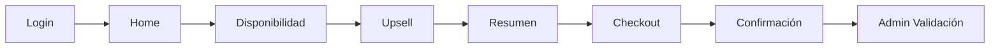
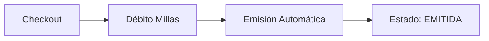
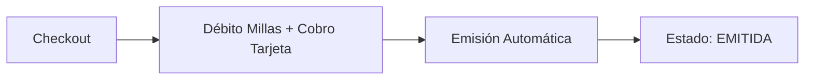

# � Mastercard Priceless 2X1 - Promociones 2X1 y Descuentos

> Portal B2C Mastercard con promociones exclusivas: 2X1 o Descuentos en productos de viaje. Modelo 100% dinero con 7 escenarios de pago/emisión.

---

## 📋 Información General

| Campo | Valor |
|-------|-------|
| **Portal Test** | https://test-skynet-pmc.smartlinks.dev/es-co |
| **Portal Demo** | https://demo-skynet-pmc.smartlinks.dev/es-co |
| **Portal Producción** | https://vuelaconoccidente.com/es-co |
| **Cliente** | Mastercard (sub-proyecto Priceless 2X1) |
| **País** | Colombia |
| **Moneda** | COP (Pesos Colombianos) |
| **Modelo de Negocio** | B2C (Business to Consumer) |
| **Plataforma** | Priceless 2X1 |
| **Célula** | Skynet |
| **Prefijo** | [Priceless] |
| **Agente QA** | PRICELESS_QA_Assistant |

---

## ⚠️ Diferencia Crítica: Priceless 2X1 vs MRS

**Ambos son proyectos de Mastercard pero COMPLETAMENTE DIFERENTES:**

| Aspecto | Priceless 2X1 | MRS |
|---------|---------------|-----|
| **Modelo** | B2C, 100% Dinero (COP) | B2B2C, Slider (Millas + Plata) |
| **Promoción** | 2X1 o Descuento | Redención con puntos |
| **País** | Colombia | Ecuador, Honduras, Guatemala, Panamá, Nicaragua, Costa Rica |
| **Dispersión** | Condicional (7 escenarios) | No aplica |
| **Fee Oculto** | Sí (en algunos escenarios) | Sí |
| **Pasarela** | PlacetoPay | [MRS y PlacetoPay] |
| **Prefijo** | [Priceless] | [MRS] |
| **Agente** | PRICELESS_QA_Assistant | MRS_QA_Assistant |

---

## 💰 Modelo de Negocio - Promociones 2X1 y Descuentos

### 🎁 Dos Tipos de Promociones

**1. Promoción 2X1 (Dos por Uno)**
```
Concepto:  Cliente paga 1 producto y obtiene 2
Pago:      100% DINERO (COP)
Emisión:   VARIABLE (según escenario 1-7)
Tarjeta:   PlacetoPay (P2P)
Cálculo:   (Base + Taxes) × 1 PAX + (Fee Transaccional × 2)
```

**Características:**
- ✅ Cliente paga solo 1 tiquete
- ✅ Fee transaccional se cobra por 2 pasajeros ($20,000 COP)
- ✅ Obtiene 2 productos/tiquetes
- ✅ Sin descuento visible, simplemente se cobra 1

**2. Promoción Descuento**
```
Concepto:  Cliente paga 2 productos con descuento aplicado
Pago:      100% DINERO (COP)
Emisión:   VARIABLE (según escenario 1-7)
Tarjeta:   PlacetoPay (P2P)
Cálculo:   [(Base + Taxes) × 2 PAX - Descuento] + (Fee Transaccional × 2)
```

**Características:**
- ✅ Cliente paga 2 productos
- ✅ Descuento aplicado al total (fijo o porcentaje)
- ✅ Fee transaccional se cobra por 2 pasajeros ($20,000 COP)
- ✅ Descuento visible claramente al usuario

### 💳 Componentes del Precio

| Componente | Valor | Visibilidad |
|------------|-------|-------------|
| **Fee Transaccional** | $10,000 COP/pasajero | ✅ Visible |
| **Fee Oculto (HF)** | Variable (según tarifa) | ❌ NO visible |
| **Base + Taxes** | Variable (del proveedor) | ✅ Visible |
| **Descuento** | Fijo o % (según campaña) | ✅ Visible (si aplica) |

---

## 🔄 7 Escenarios de Pago y Emisión

**Priceless 2X1 es el ÚNICO modelo con 7 escenarios diferentes de pago/emisión.**

### Escenario 1: Edifact - 2X1 SIN fee oculto + Dispersión ACTIVA
```
Pago:     TC Cliente (1 PQ + Fee) + TC Corporativa (1 PQ)
Emisión:  1er tiquete TC Cliente, 2do tiquete TC Corporativa
```

### Escenario 2: Edifact - 2X1 SIN fee oculto + Dispersión INACTIVA
```
Pago:     TC Cliente (total)
Emisión:  2 tiquetes CASH
```

### Escenario 3: 2X1 o Descuento CON fee oculto + Dispersión ACTIVA
```
Pago:     TC Cliente (total) + TC Corporativa (2 PQ)
Emisión:  2 tiquetes TC Corporativa
```

### Escenario 4: 2X1 o Descuento CON fee oculto + Dispersión INACTIVA
```
Pago:     TC Cliente (total)
Emisión:  2 tiquetes CASH
```

### Escenario 5: Edifact - Descuento SIN fee oculto + Dispersión ACTIVA
```
Pago:     TC Cliente (total con dispersión)
Emisión:  1er tiquete TC Cliente, 2do tiquete CASH + TC Cliente
```

### Escenario 6: Edifact - Descuento SIN fee oculto + Dispersión INACTIVA
```
Pago:     TC Cliente (total)
Emisión:  2 tiquetes CASH
```

### Escenario 7: Aggregator (Sabre NDC o Netatica)
```
Pago:     TC Cliente (total)
Emisión:  2 tiquetes CASH
```

### 📊 Tabla Resumen Escenarios

| Escenario | Promoción | Fee Oculto | Dispersión | Pago TC Cliente | Pago TC Corporativa | Emisión 1er | Emisión 2do |
|-----------|-----------|------------|------------|-----------------|---------------------|-------------|-------------|
| **1** | 2X1 | NO | SÍ | 1 PQ + Fee | 1 PQ | TC Cliente | TC Corporativa |
| **2** | 2X1 | NO | NO | Total | - | Cash | Cash |
| **3** | 2X1/Desc | SÍ | SÍ | Total | 2 PQ | TC Corporativa | TC Corporativa |
| **4** | 2X1/Desc | SÍ | NO | Total | - | Cash | Cash |
| **5** | Descuento | NO | SÍ | Total | - | TC Cliente | Cash + TC Cliente |
| **6** | Descuento | NO | NO | Total | - | Cash | Cash |
| **7** | Cualquiera | - | NO (Aggregator) | Total | - | Cash | Cash |

---

## 🗺️ Flujo E2E Completo

### Pantallas del Proceso (Todas las Transacciones)



**Descripción del Flujo:**

1. **Login**
   - Usuario ingresa credenciales o usa **SSO (Single Sign-On)**
   - **Autenticación SSO:** Token generado via `security/api/saml/acs` (vigencia 24h)
   - Tipos de usuario: **001 – Good Standing** (recomendado para testing)
   - Autenticación en MRS (Austro/Ficohsa/Coopenae)
   - Acceso a portal del cliente correspondiente
   - 📋 [Ver detalle autenticación SSO](../../../shared/Reglas%20Marketplace/MRS_COMMON_RULES.md#-autenticación-sso-single-sign-on)

2. **Home**
   - Pantalla inicial de búsqueda
   - Usuario selecciona producto (Vuelos, Hoteles, Autos, Actividades, Disney)
   - Ingresa criterios de búsqueda

3. **Disponibilidad**
   - Resultados de búsqueda
   - **Slider de Millas + Plata visible**
   - Usuario ajusta % de millas vs plata
   - Selección de opción

4. **Upsell**
   - Ofertas adicionales
   - Upgrades disponibles
   - Seguros, servicios extra

5. **Resumen**
   - Detalle completo de la selección
   - Resumen de costos
   - **Confirmación de slider:** Millas + Plata
   - Revisión antes de checkout

6. **Checkout**
   - Datos del pasajero/usuario
   - **Confirmación final de slider**
   - Datos de tarjeta (si es Millas + Plata)
   - Términos y condiciones

7. **Confirmación**
   - Código de reserva
   - Resumen de pago:
     - **Solo Millas:** Millas debitadas
     - **Millas + Plata:** Millas debitadas + Monto USD
   - Instrucciones siguientes pasos

8. **Admin - Validación de Reservas**
   - Ingreso al administrador MRS del cliente correspondiente
   - Búsqueda por código de reserva
   - Validaciones:
     - **Solo Millas (100%):** Estado EMITIDA automáticamente ✅
     - **Millas + Plata:** Estado EMITIDA automáticamente ✅

---

## �🔄 Proceso de Emisión

### ✅ Emisión Automática (Solo Millas)



**Características:**
- ✅ Sin intervención manual
- ✅ Estado EMITIDA inmediato
- ✅ Usuario recibe confirmación al instante

### 🔧 Emisión Automática (Millas + Plata)



**Características:**
- ✅ Sin intervención manual
- ✅ Estado EMITIDA inmediato
- ✅ Usuario recibe confirmación al instante
- ✅ Débito de millas y cobro en tarjeta procesados automáticamente

---

## 📦 Productos y Proveedores

### 🛫 Vuelos
- **Framework:** Angular
- **Proveedores:**
  - SABRE (directo - Edifact)
  - AGGREGATOR NETATICA
  - AGGREGATOR SABRE NDC
- **Dispersión:** Condicional (según aerolínea)
- **Fee Transaccional:** $10,000 COP por pasajero

### 🏨 Hoteles
- **Framework:** Angular
- **Proveedor:** SABRE
- **Dispersión:** Condicional (según hotel)
- **Fee Transaccional:** $10,000 COP por pasajero

### 🚗 Autos
- **Framework:** React
- **Proveedores:**
  - Hertz (global)
  - Thermeon (solo México)
- **Dispersión:** Condicional
- **Fee Transaccional:** $10,000 COP por pasajero

---

## ✅ Validaciones Críticas

### Promociones
- ✅ Tipo de promoción visible (2X1 o Descuento)
- ✅ Cálculo correcto según fórmula oficial
- ✅ Fee transaccional = $10,000 COP por pasajero ($20,000 total)
- ✅ Fee oculto NO visible al usuario
- ✅ Descuento aplicado correctamente (si aplica)

### Aeropuertos Permitidos
- ✅ Solo aeropuertos en collection allowedAirports
- ✅ Búsqueda bloqueada para aeropuertos no permitidos
- ✅ Mensaje de error claro si ruta no habilitada

### Checkout y Pago
- ✅ Campos obligatorios completos
- ✅ Redirección a PlacetoPay correcta
- ✅ Tarjeta de crédito requerida (PlacetoPay)
- ✅ Términos y condiciones aceptados
- ✅ Precio final coincide con resumen
- ✅ Escenario de pago correcto (1-7)

### Confirmación
- ✅ Código de reserva visible
- ✅ Total cobrado en COP correcto
- ✅ Valores consistentes con checkout
- ✅ Promoción aplicada visible
- ✅ Fee transaccional desglosado

### Admin Priceless
- ✅ Reserva localizable por código
- ✅ Estado EMITIDA según escenario (1-7)
- ✅ Método de emisión correcto:
  - TC Cliente (escenarios 1, 5)
  - TC Corporativa (escenario 3)
  - CASH (escenarios 2, 4, 6, 7)
  - Mixto (escenario 5)
- ✅ Dispersión ejecutada (si aplica)
- ✅ Fee oculto cubierto (si aplica)

---

## 🔄 Proceso de Cancelación

### Cancelar Reserva EMITIDA

**Estado inicial:** EMITIDA (según escenario 1-7)

**Pasos:**
1. Ingresar al admin Priceless (Skynet)
2. Buscar reserva por código
3. Click en "Cancelar" (según políticas del producto)
4. Confirmar cancelación
5. Sistema ejecuta reverso según escenario:
   - **TC Cliente:** Reverso automático
   - **TC Corporativa:** Proceso manual de reverso
   - **CASH:** Gestión manual con aerolínea/proveedor
6. Estado final: CANCELADO

**Validaciones:**
- ✅ Reserva estaba EMITIDA
- ✅ Reverso procesado correctamente
- ✅ Estado actualizado a CANCELADO
- ✅ Fee transaccional reembolsado (según políticas)

---

## 📊 Matriz de Estados por Escenario

| Escenario | Pago | Emisión | Cancelación |
|-----------|------|---------|-------------|
| **1** | TC Cliente + TC Corp | TC Cliente + TC Corp | Reverso mixto |
| **2** | TC Cliente | CASH | Reverso TC + Gestión manual |
| **3** | TC Cliente + TC Corp | TC Corporativa | Reverso mixto |
| **4** | TC Cliente | CASH | Reverso TC + Gestión manual |
| **5** | TC Cliente | TC Cliente + CASH | Reverso mixto |
| **6** | TC Cliente | CASH | Reverso TC + Gestión manual |
| **7** | TC Cliente | CASH | Reverso TC + Gestión manual |

---

## 🎯 Diferencias Clave vs MRS (Mastercard Rewards System)

| Aspecto | Priceless 2X1 | MRS |
|---------|---------------|-----|
| **Modelo** | 100% Dinero (COP) | Slider Millas + Plata |
| **Promoción** | 2X1 o Descuento | Redención con puntos |
| **Escenarios** | 7 diferentes | 2 (solo millas o mixto) |
| **Fee Transaccional** | ✅ $10,000/PAX | ❌ No |
| **Fee Oculto** | ✅ Sí (variable) | ❌ No |
| **Dispersión** | Condicional | No aplica |
| **TC Corporativa** | ✅ Sí (algunos escenarios) | ❌ No |
| **País** | Colombia | 6 países diferentes |
| **Pasarela** | PlacetoPay | [Otra] |
| **Complejidad QA** | 🔴 ALTA | 🟡 MEDIA |
| **Emisión** | Variable (7 modos) | Automática |
| **allowedAirports** | ✅ Sí (manual) | ❌ No |

---

## 📚 Documentación de Referencia

**Reglas de Negocio:**
- [PRICELESS_COMMON_RULES.md](../../../shared/Reglas%20Marketplace/PRICELESS_COMMON_RULES.md) - Reglas comunes Priceless 2X1
- [7 Escenarios de Pago/Emisión](../../../shared/Reglas%20Marketplace/PRICELESS_COMMON_RULES.md#🔄-escenarios-de-pago-y-emisión)
- [Fórmulas de Cálculo](../../../shared/Reglas%20Marketplace/PRICELESS_COMMON_RULES.md#🧮-reglas-de-cálculo-promociones-2x1-y-descuento)

**Flujos por Producto:**
- [PRICELESS_VUELOS.md](PRICELESS_VUELOS.md) - Flujo E2E Vuelos (Pendiente crear)
- [PRICELESS_HOTELES.md](PRICELESS_HOTELES.md) - Flujo E2E Hoteles (Pendiente crear)
- [PRICELESS_AUTOS.md](PRICELESS_AUTOS.md) - Flujo E2E Autos (Pendiente crear)

**Documentación Complementaria:**
- [Wiki: Mastercard - Priceless 2X1](https://dev.azure.com/ultragrouplaorg/ultragroupla/_wiki/wikis/Ultra%20Group%20Wiki/1141/Mastercard-Priceless-2X1)
- [Excel: Calcular 2x1 o descuento.xlsx](https://smartlinksdev-my.sharepoint.com/:x:/r/personal/crubiog_ultragroupla_com/_layouts/15/Doc.aspx?sourcedoc=%7B64CBE898-E0F2-402B-88AB-1093813C7C49%7D&file=Calcular%202x1%20o%20descuento.xlsx) - Fórmulas oficiales

**Agente QA:**
- [PRICELESS_QA_Assistant](../../../agents/PRICELESS_QA_Assistant.agent.md) - Agente especializado Priceless 2X1

---

## 🚀 Testing

**Complejidad:** 🔴 ALTA

**Razones:**
- 7 escenarios diferentes de pago/emisión
- Variables combinables: Promoción + Fee Oculto + Dispersión + Proveedor
- Uso dual de tarjetas (TC Cliente + TC Corporativa)
- Emisión mixta (TC Cliente, TC Corporativa, CASH, combinaciones)
- Fórmulas de cálculo específicas para cada tipo de promoción
- Aeropuertos restringidos (allowedAirports)
- Dispersión condicional por aerolínea
- Fee oculto variable y no visible

**Casos Críticos:**
1. Validar cálculo 2X1 (cliente paga 1, obtiene 2)
2. Validar cálculo Descuento (descuento sobre 2 PAX)
3. Probar cada uno de los 7 escenarios de pago/emisión
4. Verificar dispersión activa vs inactiva
5. Validar fee oculto NO visible al usuario
6. Probar TC Corporativa (escenarios 1, 3, 5)
7. Validar aeropuertos en allowedAirports
8. Verificar PlacetoPay integración correcta
9. Probar todos los proveedores (SABRE, Netatica, Sabre NDC, Hertz, Thermeon)
10. Validar cada tipo de emisión (TC Cliente, TC Corporativa, CASH, Mixta)

---

## 📞 Contacto

**Agente QA:** PRICELESS_QA_Assistant  
**Ubicación:** `.github/agents/PRICELESS_QA_Assistant.agent.md`

**Para:**
- Crear casos de prueba Priceless 2X1
- Análisis de HU Priceless
- Consultas técnicas Priceless
- Trabajo con portal vuelaconoccidente.com

---

**Última actualización:** 2026-02-03  
**Versión:** 1.0  
**Estado:** ✅ Activo

