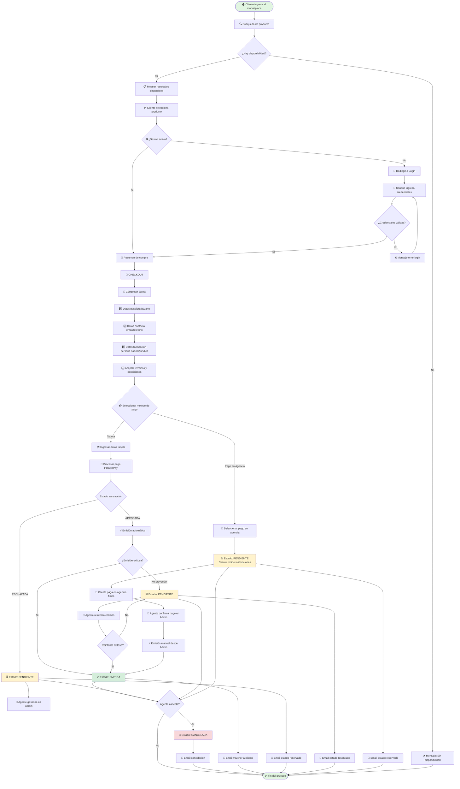

# 📋 REGLAS COMUNES CONSOLIDACIÓN COP (CCOP)

Documento de referencia con reglas, validaciones y estructura compartida para todos los productos de Consolidación COP.

---

## 🎯 IDENTIFICACIÓN Y ALCANCE

**Portal:** [URL A DEFINIR]  
**País:** Colombia  
**Prefijo obligatorio:** [CCOP]  

**Productos disponibles:**
- ✅ Vuelos (En el checkout de este producto se puede adicionar seguro de cancelación)
- ✅ Autos
- ✅ Disney (Tickets parques)
- ✅ Disney Eventos Especiales
- ✅ Asistencias (Seguros de viaje)
- ✅ Actividades
- ✅ Hoteles Disney

**Requisitos de autenticación:**
- 🔓 **Sin login:** Cliente puede navegar Home, realizar búsquedas y ver disponibilidad
- 🔒 **Login obligatorio:** Al seleccionar un producto, si no hay sesión activa → redirige a login
- ✅ **Post-login:** Tras login exitoso, regresa al checkout manteniendo la selección previa del usuario

---

## 💰 MODELO DE NEGOCIO

### ECUACIÓN DE PAGO:

**DOS MÉTODOS DE PAGO DISPONIBLES:**

```
MÉTODO 1: Tarjeta de Crédito/Débito
   → Pago: 100% TARJETA DE CRÉDITO/DÉBITO
   → Datos requeridos: Sí (se diligencian en checkout)
   → Emisión: AUTOMÁTICA
   → Flujo:
      • Transacción APROBADA → Estado: EMITIDA (email enviado)
      • Transacción RECHAZADA → Estado: PENDIENTE (requiere acción del agente)
   → Estado final: EMITIDA o PENDIENTE

MÉTODO 2: Pago en Agencia
   → Pago: 100% EFECTIVO O TARJETA EN AGENCIA
   → Datos requeridos: No (no se diligencia tarjeta en checkout)
   → Emisión: MANUAL (requiere confirmación de pago)
   → Proceso:
      1. Cliente selecciona "Pago en Agencia" en checkout
      2. Reserva queda en estado PENDIENTE
      3. Cliente acude a agencia física
      4. Cliente paga (efectivo o tarjeta en agencia)
      5. Agente confirma pago en Admin
      6. Agente emite la reserva desde Admin
      7. Estado cambia a EMITIDA
      8. Se envía email automático al cliente
   → Estado final: PENDIENTE → EMITIDA (tras confirmación en Admin)
```

### CARGOS ADICIONALES (FEES) POR PRODUCTO:

**VUELOS:**
```
1. Tarifa Administrativa (Visible)
   → Tipo: Fija o Porcentual
   → Visibilidad: Cliente ve el cargo desglosado
   → Se suma al precio final

2. Fee Oculto (No Visible)
   → Tipo: Fijo o Porcentual
   → Visibilidad: Cliente NO lo ve desglosado
   → Incluido en precio final
```

**ACTIVIDADES:**
```
Markup (No Desglosado)
   → Tipo: Fijo o Porcentual
   → Visibilidad: No se desglosa en tarifa del cliente
   → Observable: Se puede ver en los endpoint de disponibilidad/pagos
```

**OTROS PRODUCTOS (Autos, Disney, Disney Eventos Especiales, Asistencias, Hoteles Disney):**
```
Sin cargos adicionales
   → Precio = Precio del proveedor
   → Sin fees ni markups
```

### EMISIÓN:

**Emisión Automática (Default):**
- Todos los productos con **pago tarjeta de crédito/débito** → AUTOMÁTICA
- Flujo:
  1. Cliente ingresa datos de tarjeta en checkout
  2. Transacción procesada en pasarela de pago
  3. Si transacción **APROBADA** → Emisión inmediata
  4. Estado: **EMITIDA**
  5. Email automático enviado al cliente
- Tiempo de emisión: **Inmediato** (segundos tras aprobación)

**Emisión Manual (Excepción):**
- Todos los productos con **pago en agencia** → MANUAL
- Flujo:
  1. Cliente selecciona "Pago en Agencia" en checkout
  2. Reserva creada en estado: **PENDIENTE**
  3. Cliente recibe instrucciones (pantalla) para pagar en agencia
  4. Cliente acude a agencia física y paga (efectivo o tarjeta en agencia)
  5. **Agente confirma pago en Admin**
  6. **Agente emite la reserva desde Admin**
  7. Estado cambia a: **EMITIDA**
  8. Email automático enviado al cliente
- Tiempo de emisión: **Variable** (depende de cuándo cliente pague en agencia)
- Herramienta: **Admin de Consolidación COP**

---

## 📦 ESTRUCTURA DE PROVEEDORES

```
CONSOLIDACIÓN COP (CCOP)
├─ ✈️ VUELOS [Framework Angular]
│  ├─ [AGGREGATOR NETACTICA]
│  ├─ [AGGREGATOR SABRE]
│  └─ [SABRE EDIFACT]
│
├─ 🚗 AUTOS [Framework React]
│  ├─ Localidades de Estados Unidos y Europa proveedor Sabre (Rentadoras: Hertz, Dollar, Thrifty)
│  └─ Localidades de México proveedor Thermeon (Rentadoras: Hertz, Dollar, Thrifty)
│
├─ 🎢 DISNEY [Framework React]
│  └─ [DerbySoft]
│
├─ 🎢 DISNEY EVENTOS ESPECIALES [Framework React]
│  └─ [DerbySoft]
│
│  🛡️ ASISTENCIAS [Framework Angular]
│   └─ [AssistViaje]
│
├─ 🎯 ACTIVIDADES [Framework Angular]
│  └─ HotelBeds
│
└─ 🏨 HOTELES DISNEY [Framework Angular]
   └─ HotelBeds
```

---

## 🎨 FRAMEWORKS POR PRODUCTO

| Producto | Framework | Observaciones |
|----------|-----------|---------------|
| Vuelos | [Angular] | Múltiples proveedores, emisión Automatica |
| Autos | [React] | Dos proveedores, emisión Automatica |
| Disney | [React] | Un proveedor, emisión Automatica |
| Disney Eventos Especiales | [React] | Un proveedor, emisión Automatica |
| Asistencias | [Angular] | Un proveedor, emisión Automatica |
| Actividades | [Angular] | Un proveedor, emisión automatica |
| Hoteles Disney | [Angular] | Un proveedor, emisión automatica |

---

## ✅ VALIDACIONES CRÍTICAS COMUNES

### 1️⃣ VALIDACIÓN DE AUTENTICACIÓN (LOGIN)

**🔒 REQUISITO OBLIGATORIO PARA CHECKOUT**

**Flujo de autenticación:**
- 🔓 **Sin login permitido:** Home, Búsqueda, Disponibilidad
- 🔒 **Login obligatorio:** Al seleccionar producto para avanzar al checkout
- 🔄 **Redirección automática:** Si no hay sesión activa → Login → Checkout (mantiene selección)

**Validaciones de credenciales:**
- ✅ Usuario registrado en el marketplace
- ✅ Contraseña correcta
- ✅ Cuenta activa (no bloqueada)

**Experiencia de usuario:**
- Cliente navega y explora productos sin necesidad de login
- Al momento de reservar, el sistema solicita autenticación
- Tras login exitoso, el usuario regresa directamente al checkout con su selección preservada
- La selección previa del producto se mantiene en sesión

---

### 2️⃣ VALIDACIÓN DE SALDO

**❌ NO APLICA PARA ESTE MODELO**

- Este marketplace **NO maneja saldo ni crédito**
- Los marketplaces **NO tienen cupo asignado**
- El cliente paga **100% directamente** (tarjeta o efectivo en agencia física)
- No hay validación de saldo en búsqueda, selección ni checkout

---

### 2️⃣ VALIDACIÓN DE CHECKOUT

**DATOS OBLIGATORIOS:**

✅ **1. Datos de Pasajeros/Usuarios**
   - Nombre completo
   - Documento de identidad
   - [Otros campos según producto - Ver doc específica]

✅ **2. Datos de Contacto**
   - Email
   - Teléfono

✅ **3. Datos de Facturación**
   - Tipo de persona: **Natural** o **Jurídica**
   - **Persona Natural:**
     - Nombres
     - Apellidos
     - Tipo de documento
     - Número de documento
   - **Persona Jurídica:**
     - Razón social
     - Tipo de documento
     - Número de documento (NIT)
   - Dirección
   - Ciudad
   - Teléfono

✅ **4. Términos y Condiciones**
   - Aceptación obligatoria

✅ **5. Método de Pago**
   - Selección: Tarjeta o Pago en Agencia

**VALIDACIONES POR MÉTODO DE PAGO:**

**TARJETA DE CRÉDITO/DÉBITO:**
```
✓ Número de tarjeta (formato válido)
✓ CVV (3 o 4 dígitos)
✓ Fecha de expiración (formato MM/AA, no vencida)
✓ Nombre titular
✓ Validaciones adicionales de pasarela de pago
```

**PAGO EN AGENCIA:**
```
✓ Solo confirmar selección de método
✓ No requiere datos adicionales de pago
✓ Cliente recibe instrucciones para acudir a agencia
```

**VALIDACIONES GENERALES:**
- ✅ Todos los campos obligatorios diligenciados
- ✅ Formatos correctos (email, teléfono, documentos)
- ✅ Términos y condiciones aceptados

---

### 3️⃣ VALIDACIÓN DE EMISIÓN

**CRITERIO PRINCIPAL:**
- ✅ **Pago APROBADO** (tarjeta) o **Pago CONFIRMADO en Admin** (agencia)

**FLUJO DE EMISIÓN:**

```
1. Validar pago aprobado/confirmado
2. Llamar endpoint de emisión del proveedor
3. Respuesta del proveedor:
   ├─ ✅ ÉXITO → Reserva pasa a EMITIDA
   └─ ❌ FALLA → Reserva queda en PENDIENTE
```

**ESCENARIO: FALLA DE EMISIÓN**

⚠️ **¿Puede fallar emisión después de pago aprobado?**  
→ **SÍ**, el endpoint del proveedor puede fallar

**¿Qué ocurre cuando falla?**
```
Pago: APROBADO ✅
Emisión: FALLIDA ❌
Estado: PENDIENTE (requiere intervención manual)
```

**GESTIÓN DE REINTENTO:**
- ❌ **NO hay reintento automático**
- 🔧 **Gestión manual:** Agente debe reintentar emisión desde **Admin**
- 🔔 **Notificación:** Se notifica al **agente** (NO al cliente)
- 👤 **Responsable:** Agente en Admin gestiona el reintento
- ✅ **Resolución:** Una vez emitida exitosamente → Estado: **EMITIDA** + Email al cliente

**TIPOS DE EMISIÓN:**
- ✅ **Emisión Automática:** Pago con tarjeta aprobado → Emisión inmediata
- ✅ **Emisión Manual:** Pago en agencia confirmado por agente → Emisión desde Admin
- ❌ **Emisión Semiautomática:** NO APLICA

---

## 🔍 ESTADOS DE RESERVA

| Estado | Descripción | ¿Cómo se llega a este estado? | Transiciones posibles |
|--------|-------------|-------------------------------|----------------------|
| **EMITIDA** | Reserva confirmada y emitida con proveedor. Cliente recibe voucher/confirmación por email. | **1.** Pago con tarjeta APROBADO + Emisión exitosa<br>**2.** Pago en agencia confirmado por agente + Emisión exitosa | → **CANCELADA** (solo por agente desde Admin) |
| **PENDIENTE** | Reserva creada pero requiere acción del agente. Puede ser por: pago pendiente en agencia, pago con tarjeta rechazado o emisión fallida con proveedor. | **1.** Cliente selecciona "Pago en Agencia" en checkout<br>**2.** Pago con tarjeta RECHAZADO (requiere gestión del agente)<br>**3.** Pago con tarjeta APROBADO pero endpoint de emisión del proveedor **FALLÓ** | → **EMITIDA** (tras pago confirmado + emisión exitosa)<br>→ **PENDIENTE** (reintento emisión falla, continúa igual)<br>→ **CANCELADA** (por agente desde Admin) |
| **CANCELADA** | Reserva cancelada por el agente desde el Admin. No se puede recuperar. | **1.** Agente cancela desde Admin una reserva en cualquier estado | → **Sin transiciones** (estado final) |

---

### 📋 REGLAS DE ESTADOS

**✅ REGLAS DE CANCELACIÓN:**
- ❌ **Cliente NO puede cancelar:** No existe opción de auto-cancelación para el cliente
- ✅ **Agente SÍ puede cancelar:** Desde Admin, puede cancelar reservas en cualquier estado
- 🔒 **Estado CANCELADA es final:** No hay reversión posible
- ❌ **No existe estado REEMBOLSADA:** Las cancelaciones no generan estado de reembolso

**✅ REGLAS DE MODIFICACIÓN:**
- ❌ **Cliente NO puede modificar:** No existe funcionalidad de modificación de reservas
- ❌ **No existe estado MODIFICADA:** Las reservas mantienen su estado original
- 💡 **Alternativa:** Para cambios, el agente debe cancelar y crear nueva reserva

**✅ REGLAS DE EMISIÓN FALLIDA (PENDIENTE):**
- 🔄 **Reintento manual:** Agente reintenta emisión desde Admin
- ♻️ **Reintento ilimitado:** Si falla, continúa en PENDIENTE para nuevos reintentos
- ⚠️ **Sin reintento automático:** Sistema NO reintenta automáticamente
- 🔧 **Resolución:** Agente decide continuar reintentando o cancelar la reserva

**✅ REGLAS DE EXPIRACIÓN:**
- ❌ **No existe estado EXPIRADA:** Las reservas PENDIENTE no expiran automáticamente
- 🔧 **Gestión manual:** Si el cliente no paga, el agente debe cancelar manualmente desde Admin

**❌ ESTADOS QUE NO EXISTEN:**
- ❌ EXPIRADA
- ❌ REEMBOLSADA
- ❌ MODIFICADA
- ❌ RECHAZADA
- ❌ ERROR
- ❌ EN PROCESO

---

### 📧 NOTIFICACIONES POR ESTADO

| Estado | ¿Envía email al cliente? | ¿Notifica al agente? | Contenido |
|--------|-------------------------|---------------------|-----------|
| **EMITIDA** | ✅ SÍ (automático) | ❌ NO | Voucher/confirmación de reserva |
| **PENDIENTE** | ✅ SÍ (automático) | ❌ NO | **Cliente:** Notificación indicando que la reserva quedó en estado reservado<br>**Agente:** Alerta para gestionar la reserva (pago pendiente, pago rechazado o emisión fallida) |
| **CANCELADA** | ✅ SÍ (automático) | ❌ NO | Notificación de cancelación de reserva |

---

### 🔄 DIAGRAMA DE TRANSICIONES

```
┌─────────────────┐
│  CHECKOUT       │
└────────┬────────┘
         │
         ├──► Pago Tarjeta APROBADO + Emisión OK ──────────────────► EMITIDA ────┐
         │                                                                │         │
         ├──► Pago en Agencia seleccionado ─────────────────────────► PENDIENTE ──┤
         │                                                                │         │
         ├──► Pago Tarjeta RECHAZADO ───────────────────────────────────►  │        │
         │                                                                │         │
         └──► Pago Tarjeta APROBADO + Emisión FALLA ───────────────────►  │        │
                                                                           │         │
                    ┌──────────────────────────────────────────────────────┘         │
                    │                                                                │
                    │  Agente confirma pago + emite                                  │
                    ▼                                                                │
               ┌─────────┐                                                           │
               │ EMITIDA │◄──────────────────────────────────────────────────────────┘
               └────┬────┘                                                            
                    │                                                                
                    │  Agente cancela desde Admin                                    
                    ▼                                                                
            ┌──────────────┐          ┌─────────────────────────────────────────────┘
            │  CANCELADA   │  ◄───────┤ Agente cancela desde Admin
            │(estado final)│          │ (desde cualquier estado)
            └──────────────┘          └─────────────────────────────────────────────
```

---

### 📝 NOTAS IMPORTANTES

- 📧 **Notificaciones por email:**
  - ✅ **EMITIDA:** Email con voucher/confirmación
  - ✅ **PENDIENTE:** Email informando que reserva quedó en estado reservado (requiere gestión)
  - ✅ **CANCELADA:** Email notificando la cancelación de la reserva

- ⚠️ **Estado PENDIENTE tiene 3 causas posibles:**
  - 🏦 Cliente seleccionó "Pago en Agencia" (esperando pago)
  - 💳 Pago con tarjeta RECHAZADO (requiere gestión del agente)
  - ❌ Pago aprobado pero emisión con proveedor FALLÓ (requiere reintento)

- 🔧 **Gestión manual requerida:** Todas las reservas PENDIENTE requieren acción del agente en Admin
- ❌ **Pago rechazado NO reintenta:** Sistema NO permite reintento automático de pago. Agente debe gestionar
- 🔄 **Sin límite de reintentos de emisión:** Cuando falla emisión, se puede reintentar indefinidamente
- 🔒 **Gestión exclusiva por agente:** Solo el agente desde Admin puede cancelar reservas. Cliente no tiene esta opción
- ⏱️ **Sin expiración automática:** Las reservas PENDIENTE NO expiran, deben ser gestionadas manualmente

---

## 📍 REGLAS ESPECÍFICAS DE PAÍS

**País:** Colombia  
**Moneda principal:** COP (Pesos Colombianos)

---

### 🆔 DOCUMENTOS DE IDENTIDAD

**Tipos de documentos aceptados:**
- ✅ **Cédula de Ciudadanía** (Colombia)
- ✅ **Pasaporte** (Internacional)

**Validaciones:**
- ✅ **Cédula de Ciudadanía:** Debe tener exactamente **10 dígitos**
- ✅ **Pasaporte:** Formato alfanumérico estándar internacional

---

### 💰 MONEDA Y CONVERSIÓN

**Regla general:**
- 📍 **Todos los productos** se muestran y cobran en **COP (Pesos Colombianos)**

**Excepciones por producto:**

**🚗 AUTOS:**
```
Disponibilidad: Se muestra en USD por defecto
              → Cliente puede cambiar visualización a COP
Pago final:    Siempre se cobra en COP
Conversión:    Sistema aplica conversión automática USD → COP al momento del pago
```

**🎢 DISNEY (Tickets Parques):**
```
Disponibilidad: Se muestra en USD
Selección:      Se mantiene en USD
Checkout:       Se cobra en USD
Conversión:     NO se hace conversión a COP
Nota:           Cliente paga directamente en dólares (USD)
```

**Resumen de monedas por producto:**
| Producto | Moneda de visualización | Moneda de cobro | ¿Conversión? |
|----------|------------------------|----------------|--------------|
| Vuelos | COP | COP | No aplica |
| Autos | USD (cambiable a COP) | COP | Sí (USD → COP) |
| Disney | USD | USD | No |
| Disney Eventos Especiales | USD | USD | No |
| Asistencias | COP | COP | No aplica |
| Actividades | COP | COP | No aplica |
| Hoteles Disney | COP | COP | No aplica |

---

### 🧾 IMPUESTOS

**VUELOS:**
- ✅ **Impuestos desglosados:** Los impuestos se muestran de forma separada en el desglose de precio
- 📋 **Visibilidad:** Cliente puede ver claramente cuánto corresponde a impuestos

**OTROS PRODUCTOS:**
- 📍 **Sin desglose confirmado:** No se especifica si hay impuestos desglosados
- 💡 **Precio final:** Los precios pueden incluir impuestos, pero no se muestran de forma separada

---

### 💳 FORMAS DE PAGO

**Pasarela de pago:**
- 🏦 **PlacetoPay** (única pasarela habilitada)

**Métodos de pago disponibles:**
1. **Tarjeta de Crédito/Débito** (procesada por PlacetoPay)
2. **Pago en Agencia Física** (efectivo o tarjeta en agencia)

---

### 🚫 REGULACIONES Y RESTRICCIONES

**Restricciones por edad:**
- ✅ **NO hay restricciones por edad** para ningún producto
- 💡 **Nota:** El sistema permite reservas para todas las edades

---

## 🎯 FORMATO DE TÍTULO DE CASOS DE PRUEBA

### 📐 ESTRUCTURA OFICIAL DEL TÍTULO:

```
[CCOP] [Momento] Agrupador: Validar {Descripción del objetivo}(+)
```

**Componentes obligatorios:**

1. **[CCOP]** → Prefijo del portal (obligatorio)
2. **[Momento]** → Etapa de la aplicación donde se ejecuta el test
3. **Agrupador** → Incremento/HU/Feature relacionado
4. **Validar** → Palabra clave (obligatoria)
5. **{Descripción}** → Objetivo específico del test (nemotécnico)
6. **(+)** → Indicador de detalles adicionales en pasos (opcional)

---

### 🎭 MOMENTOS DE APLICACIÓN:

| Momento | Descripción | Ejemplos de pruebas |
|---------|-------------|---------------------|
| **[Home]** | Página principal, login y navegación general | Login, Header, Footer, Menú principal |
| **[Availability]** | Búsqueda, disponibilidad y resumen de productos | Búsquedas, Filtros, Resultados, Selección |
| **[Checkout]** | Proceso de checkout y métodos de pago | Datos pasajero, Facturación, Validaciones, Pagos |
| **[Confirmation]** | Confirmación de reserva y envío de correos | Estados, Emails, Vouchers |
| **[Admin]** | Administración y gestión de reservas | Emisión manual, Cancelaciones, Reportes |
| **[Webjobs]** | Procesos automáticos y tareas programadas | Jobs de emisión, Sincronizaciones |
| **[Transversal]** | Funcionalidades que afectan múltiples momentos | Header, Footer, Cambio de idioma, Sesión |

---

### 📝 EJEMPLOS POR MOMENTO Y PRODUCTO:

#### 🏠 **[HOME] - Página Principal y Login:**

**Login y autenticación:**
- [CCOP] [Home] Login marketplace: Validar acceso con credenciales válidas
- [CCOP] [Home] Login marketplace: Validar mensaje error con credenciales inválidas
- [CCOP] [Home] Sesión: Validar cierre de sesión exitoso

**Navegación:**
- [CCOP] [Home] Header: Validar menú de productos disponibles
- [CCOP] [Home] Footer: Validar enlaces de información corporativa

---

#### 🔍 **[AVAILABILITY] - Búsqueda y Disponibilidad:**

**VUELOS:**
- [CCOP] [Availability] Vuelos Aggregator Netactica: Validar búsqueda ida y vuelta nacional
- [CCOP] [Availability] Vuelos Aggregator Sabre: Validar resultados sin disponibilidad
- [CCOP] [Availability] Vuelos: Validar filtro por aerolínea
- [CCOP] [Availability] Vuelos múltiples proveedores: Validar comparación de tarifas(+)
- [CCOP] [Availability] Vuelos resumen: Validar desglose de impuestos y fees(+)

**AUTOS:**
- [CCOP] [Availability] Autos Sabre USA: Validar visualización en USD con cambio a COP
- [CCOP] [Availability] Autos Thermeon México: Validar búsqueda rentadora Hertz
- [CCOP] [Availability] Autos: Validar conversión USD a COP en resumen(+)

**DISNEY:**
- [CCOP] [Availability] Disney DerbySoft: Validar búsqueda tickets en USD
- [CCOP] [Availability] Disney: Validar selección múltiples entradas diferentes fechas(+)
- [CCOP] [Availability] Disney Eventos Especiales: Validar disponibilidad eventos en USD

**ACTIVIDADES:**
- [CCOP] [Availability] Actividades HotelBeds: Validar búsqueda por destino COP
- [CCOP] [Availability] Actividades: Validar filtrado por categoría tours
- [CCOP] [Availability] Actividades resumen: Validar markup no desglosado en tarifa cliente(+)

**ASISTENCIAS:**
- [CCOP] [Availability] Asistencias AssistViaje: Validar búsqueda plan básico COP
- [CCOP] [Availability] Asistencias: Validar comparación de planes

**HOTELES DISNEY:**
- [CCOP] [Availability] Hoteles Disney HotelBeds: Validar búsqueda disponibilidad COP

---

#### 🛒 **[CHECKOUT] - Proceso de Pago:**

**Validaciones de datos:**
- [CCOP] [Checkout] Datos pasajero: Validar campos obligatorios completos
- [CCOP] [Checkout] Datos pasajero: Validar formato cédula ciudadanía 10 dígitos
- [CCOP] [Checkout] Datos pasajero: Validar formato pasaporte internacional
- [CCOP] [Checkout] Facturación persona natural: Validar datos completos(+)
- [CCOP] [Checkout] Facturación persona jurídica: Validar NIT y razón social(+)
- [CCOP] [Checkout] Términos y condiciones: Validar aceptación obligatoria

**Métodos de pago:**
- [CCOP] [Checkout] Pago tarjeta PlacetoPay: Validar transacción aprobada estado EMITIDA
- [CCOP] [Checkout] Pago tarjeta PlacetoPay: Validar transacción rechazada estado PENDIENTE
- [CCOP] [Checkout] Pago en agencia: Validar reserva queda PENDIENTE con instrucciones
- [CCOP] [Checkout] Pago tarjeta: Validar validaciones CVV y fecha expiración(+)

**Casos específicos por producto:**
- [CCOP] [Checkout] Vuelos: Validar adición seguro de cancelación
- [CCOP] [Checkout] Vuelos: Validar desglose tarifa administrativa visible(+)
- [CCOP] [Checkout] Autos: Validar precio final en COP con conversión desde USD(+)
- [CCOP] [Checkout] Disney: Validar precio final en USD sin conversión(+)

---

#### ✅ **[CONFIRMATION] - Confirmación y Notificaciones:**

**Estados de reserva:**
- [CCOP] [Confirmation] Estado EMITIDA: Validar email automático con voucher cliente
- [CCOP] [Confirmation] Estado PENDIENTE: Validar email estado reservado requiere gestión
- [CCOP] [Confirmation] Estado CANCELADA: Validar email notificación cancelación
- [CCOP] [Confirmation] Estado PENDIENTE: Validar alerta notificación agente Admin(+)

**Emisión:**
- [CCOP] [Confirmation] Emisión automática: Validar emisión exitosa tras pago aprobado
- [CCOP] [Confirmation] Emisión fallida proveedor: Validar reserva queda PENDIENTE
- [CCOP] [Confirmation] Confirmación: Validar datos completos en voucher cliente(+)

---

#### 🔧 **[ADMIN] - Administración y Gestión:**

**Gestión de pagos:**
- [CCOP] [Admin] Pago en agencia: Validar confirmación de pago por agente
- [CCOP] [Admin] Emisión manual: Validar emisión tras confirmación pago agencia
- [CCOP] [Admin] Emisión fallida: Validar reintento manual cambia PENDIENTE a EMITIDA

**Gestión de estados:**
- [CCOP] [Admin] Cancelación: Validar cancelación reserva EMITIDA por agente
- [CCOP] [Admin] Cancelación: Validar cancelación reserva PENDIENTE por agente
- [CCOP] [Admin] Estados: Validar reserva PENDIENTE sin expiración automática(+)

**Consultas:**
- [CCOP] [Admin] Reportes: Validar búsqueda reservas por estado
- [CCOP] [Admin] Reportes: Validar filtrado por fecha y producto(+)

---

#### ⚙️ **[WEBJOBS] - Procesos Automáticos:**

- [CCOP] [Webjobs] Emisión automática: Validar job emisión reservas PENDIENTE con pago aprobado
- [CCOP] [Webjobs] Sincronización: Validar actualización estados proveedores(+)
- [CCOP] [Webjobs] Notificaciones: Validar envío correos pendientes(+)

---

#### 🔄 **[TRANSVERSAL] - Funcionalidades Compartidas:**

**Navegación:**
- [CCOP] [Transversal] Header: Validar menú productos en todas las páginas
- [CCOP] [Transversal] Footer: Validar enlaces información en todas las páginas
- [CCOP] [Transversal] Sesión: Validar persistencia datos usuario entre páginas(+)

**Monedas:**
- [CCOP] [Transversal] Conversión moneda: Validar visualización correcta COP vs USD(+)
- [CCOP] [Transversal] Autos: Validar cambio visualización USD a COP en toda la experiencia(+)

---

### 📋 ESTRUCTURA COMPLETA DEL CASO DE PRUEBA (Azure Test Plans):

**Campos obligatorios:**
- ✅ **ID:** Generado automáticamente por Azure
- ✅ **Título:** Siguiendo formato [CCOP] [Momento] Agrupador: Validar {Descripción}(+)

**Campos opcionales pero recomendados:**
- 📝 **Description:** Propósito del test case
- 🔍 **Considerations:** Precondiciones/estado inicial requerido
- 📊 **Steps:** Pasos detallados de ejecución

**Formato de Steps (si aplica (+)):**

| Paso | Acción esperada | Resultado esperado |
|------|----------------|-------------------|
| 1 | Ingresar al portal {URL} | Se carga la página correctamente |
| 2 | Realizar búsqueda con parámetros {X} | Se muestran resultados disponibles |
| 3 | Seleccionar opción {Y} | Se avanza a checkout |

---

### 💡 REGLAS Y MEJORES PRÁCTICAS:

**✅ DEBE HACER:**
1. Usar siempre el prefijo **[CCOP]** al inicio
2. Incluir el **[Momento]** correcto según la etapa
3. Usar la palabra **"Validar"** después del agrupador
4. Ser **específico y nemotécnico** en la descripción
5. Agregar **(+)** si el test tiene pasos detallados
6. Incluir **proveedor** cuando el producto tiene múltiples (ej: Vuelos)
7. Especificar **moneda** cuando sea relevante (USD/COP)
8. Mantener **títulos concisos** (máximo 120 caracteres)

**❌ NO DEBE HACER:**
1. ❌ Usar "etc.", "como sea", "parecido a"
2. ❌ Ambigüedades o descripciones genéricas
3. ❌ Olvidar el prefijo [CCOP]
4. ❌ Omitir la palabra "Validar"
5. ❌ Títulos excesivamente largos o confusos

**🔄 MANTENIMIENTO:**
- Actualizar test cases ante cambios en requisitos (durante DEMO)
- Validar alineación con criterios de aceptación
- Revisar ortografía y formato
- Mantener trazabilidad con HU/Features

---

### 📌 AGRUPADORES RECOMENDADOS:

Usa nombres de HU, Features o Incrementos para el agrupador:
- Rebranding
- Muscle
- Matriz
- Fechas flexibles
- Pago en agencia
- Emisión automática
- Gestión estados
- {Nombre de la HU específica}

---

## 🚦 FLUJO GENERAL DE COMPRA

### 📊 DIAGRAMA COMPLETO DEL FLUJO:



---

### 🎯 RESUMEN DE FLUJOS PRINCIPALES:

#### **FLUJO 1: PAGO TARJETA EXITOSO (Emisión Automática)**
```
Cliente → Búsqueda (sin login) → Disponibilidad (sin login) 
→ Selección producto → Validación login → [Si no login: Login] 
→ Checkout → Datos completos → Pago Tarjeta → APROBADO 
→ Emisión automática → EMITIDA → Email voucher → FIN
```
⏱️ **Tiempo total:** Inmediato (segundos)
📝 **Nota:** Login solo requerido al avanzar a checkout

---

#### **FLUJO 2: PAGO TARJETA RECHAZADO**
```
Cliente → Búsqueda (sin login) → Disponibilidad (sin login) 
→ Selección producto → Validación login → [Si no login: Login] 
→ Checkout → Datos completos → Pago Tarjeta → RECHAZADO 
→ PENDIENTE → Email estado reservado → Agente gestiona en Admin 
→ [Decisión: Emitir o Cancelar]
```
⏱️ **Tiempo total:** Variable (depende de gestión agente)

---

#### **FLUJO 3: EMISIÓN FALLIDA (Pago aprobado, proveedor falla)**
```
Cliente → Búsqueda (sin login) → Disponibilidad (sin login) 
→ Selección producto → Validación login → [Si no login: Login] 
→ Checkout → Datos completos → Pago Tarjeta → APROBADO 
→ Emisión automática → FALLA PROVEEDOR → PENDIENTE 
→ Email estado reservado → Agente reintenta en Admin 
→ [Éxito: EMITIDA | Fallo: continúa PENDIENTE]
```
⏱️ **Tiempo total:** Variable (depende de reintentos)

---

#### **FLUJO 4: PAGO EN AGENCIA (Emisión Manual)**
```
Cliente → Búsqueda (sin login) → Disponibilidad (sin login) 
→ Selección producto → Validación login → [Si no login: Login] 
→ Checkout → Datos completos → Selecciona "Pago en Agencia" 
→ PENDIENTE → Email instrucciones → Cliente paga en agencia física 
→ Agente confirma pago en Admin → Agente emite reserva 
→ EMITIDA → Email voucher → FIN
```
⏱️ **Tiempo total:** Variable (depende de cuándo cliente pague)

---

### 📋 PUNTOS CLAVE DEL FLUJO:

**🔒 AUTENTICACIÓN OBLIGATORIA:**
- Sin login: Home, Búsqueda, Disponibilidad
- Con login requerido: Selección de producto → Checkout
- Redirección automática: Si no hay sesión → Login → Checkout (mantiene selección)

**✅ VALIDACIONES EN CHECKOUT:**
1. Usuario autenticado (login exitoso)
2. Datos de pasajero/usuario (completos)
3. Datos de contacto (email, teléfono)
4. Datos de facturación (persona natural/jurídica)
5. Términos y condiciones (aceptación obligatoria)
6. Método de pago (tarjeta o agencia)

**💳 MÉTODOS DE PAGO:**
- **Tarjeta:** PlacetoPay → Emisión automática
- **Agencia:** Pago físico → Emisión manual desde Admin

**📊 ESTADOS POSIBLES:**
- ✅ **EMITIDA:** Reserva confirmada con proveedor
- ⏳ **PENDIENTE:** Requiere acción del agente (3 causas)
- 🚫 **CANCELADA:** Cancelada por agente desde Admin

**🔄 CAUSAS DE ESTADO PENDIENTE:**
1. Cliente seleccionó "Pago en Agencia"
2. Pago con tarjeta RECHAZADO
3. Pago aprobado pero emisión con proveedor FALLÓ

**📧 NOTIFICACIONES:**
- EMITIDA → Email con voucher
- PENDIENTE → Email estado reservado
- CANCELADA → Email notificación cancelación

**🔧 GESTIÓN ADMIN:**
- Confirmar pago en agencia
- Emisión manual
- Reintento emisión fallida
- Cancelación de reservas (cualquier estado)

---

### ⚠️ NOTAS IMPORTANTES:

1. **❌ NO hay validación de saldo:** Este marketplace NO maneja saldo ni crédito
2. **🔄 Reintentos ilimitados:** Emisión fallida puede reintentarse indefinidamente
3. **⏱️ Sin expiración:** Reservas PENDIENTE NO expiran automáticamente
4. **🔒 Cancelación exclusiva:** Solo agente puede cancelar desde Admin
5. **💰 Monedas por producto:**
   - Vuelos, Actividades, Asistencias, Hoteles Disney → COP
   - Autos → USD (visualización) / COP (cobro)
   - Disney, Disney Eventos → USD (sin conversión)

---

## 📚 DOCUMENTACIÓN DE PRODUCTOS

**Documentos específicos (7 productos):**
- 📋 [CCOP_VUELOS.md](../../products/B2B/Ultra/CONSOLIDACION%20COP/CCOP_VUELOS.md) ✅
- 📋 [CCOP_AUTOS.md](../../products/B2B/Ultra/CONSOLIDACION%20COP/CCOP_AUTOS.md) ✅
- 📋 [CCOP_DISNEY.md](../../products/B2B/Ultra/CONSOLIDACION%20COP/CCOP_DISNEY.md) ✅
- 📋 [CCOP_DISNEY_EVENTOS_ESPECIALES.md](../../products/B2B/Ultra/CONSOLIDACION%20COP/CCOP_DISNEY_EVENTOS_ESPECIALES.md) ✅
- 📋 [CCOP_ASISTENCIAS.md](../../products/B2B/Ultra/CONSOLIDACION%20COP/CCOP_ASISTENCIAS.md) ✅
- 📋 [CCOP_ACTIVIDADES.md](../../products/B2B/Ultra/CONSOLIDACION%20COP/CCOP_ACTIVIDADES.md) ✅
- 📋 [CCOP_HOTELES_DISNEY.md](../../products/B2B/Ultra/CONSOLIDACION%20COP/CCOP_HOTELES_DISNEY.md) ✅

---

## 🔗 REFERENCIAS

**Reglas compartidas globales:**
- 📋 [SHARED_QA_RULES.md](../SHARED_QA_RULES.md)
- 📋 [AGENT_CONTEXT_VALIDATION.md](../AGENT_CONTEXT_VALIDATION.md)

**Agente especializado:**
- 🤖 [CCOP_QA_Assistant.agent.md](../../agents/CCOP_QA_Assistant.agent.md)

---

## 📝 NOTAS DE IMPLEMENTACIÓN

**Estado del documento:** ✅ COMPLETO (Pendiente solo URL y Azure DevOps)

**✅ COMPLETADO:**
- [x] ✅ Definir productos disponibles → 7 productos documentados
- [x] ✅ Definir modelo de negocio → Efectivo (COP/USD) con 2 métodos de pago
- [x] ✅ Definir tipo de emisión → Automática y Manual por producto
- [x] ✅ Definir proveedores por producto → 7 proveedores documentados
- [x] ✅ Definir frameworks tecnológicos → Angular y React por producto
- [x] ✅ Definir estados de reserva → 3 estados (EMITIDA, PENDIENTE, CANCELADA)
- [x] ✅ Definir validaciones críticas → 12 validaciones documentadas
- [x] ✅ Definir reglas específicas de país → Colombia completo
- [x] ✅ Definir formato de casos de prueba → Azure Test Plans con 70+ ejemplos
- [x] ✅ Definir flujo general de compra → Diagrama completo con login
- [x] ✅ Definir requisitos de autenticación → Login en selección de producto

**⏳ PENDIENTES (Externos):**
- [ ] ⏳ Definir URL del portal → Requiere definición externa
- [ ] ⏳ Configurar Azure DevOps (planId, suiteId) → Requiere configuración externa
- [ ] ⏳ Crear documentación específica por producto → Siguiente fase

**Última actualización:** 2026-01-23  
**Responsable:** CCOP_QA_Assistant  
**Célula:** Transversal
